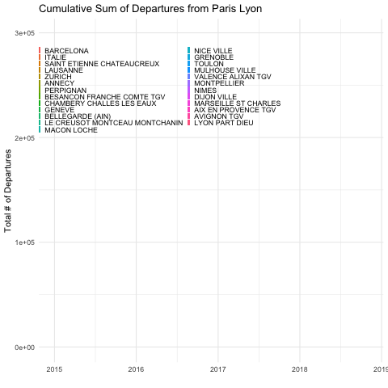

```r
library(tidyverse)     # for data cleaning and plotting
library(gardenR)       # for Lisa's garden data
library(lubridate)     # for date manipulation
library(openintro)     # for the abbr2state() function
library(palmerpenguins)# for Palmer penguin data
library(maps)          # for map data
library(ggmap)         # for mapping points on maps
library(gplots)        # for col2hex() function
library(RColorBrewer)  # for color palettes
library(sf)            # for working with spatial data
library(leaflet)       # for highly customizable mapping
library(ggthemes)      # for more themes (including theme_map())
library(plotly)        # for the ggplotly() - basic interactivity
library(gganimate)     # for adding animation layers to ggplots
library(transformr)    # for "tweening" (gganimate)
library(gifski)        # need the library for creating gifs but don't need to load each time
library(shiny)         # for creating interactive apps
library(zoo)
theme_set(theme_minimal())
```


```r
# SNCF Train data
small_trains <- read_csv("https://raw.githubusercontent.com/rfordatascience/tidytuesday/master/data/2019/2019-02-26/small_trains.csv") 

# Lisa's garden data
data("garden_harvest")

# Lisa's Mallorca cycling data
mallorca_bike_day7 <- read_csv("https://www.dropbox.com/s/zc6jan4ltmjtvy0/mallorca_bike_day7.csv?dl=1") %>% 
  select(1:4, speed)

# Heather Lendway's Ironman 70.3 Pan Am championships Panama data
panama_swim <- read_csv("https://raw.githubusercontent.com/llendway/gps-data/master/data/panama_swim_20160131.csv")

panama_bike <- read_csv("https://raw.githubusercontent.com/llendway/gps-data/master/data/panama_bike_20160131.csv")

panama_run <- read_csv("https://raw.githubusercontent.com/llendway/gps-data/master/data/panama_run_20160131.csv")

#COVID-19 data from the New York Times
covid19 <- read_csv("https://raw.githubusercontent.com/nytimes/covid-19-data/master/us-states.csv")
```

## Put your homework on GitHub!

Go [here](https://github.com/llendway/github_for_collaboration/blob/master/github_for_collaboration.md) or to previous homework to remind yourself how to get set up. 

Once your repository is created, you should always open your **project** rather than just opening an .Rmd file. You can do that by either clicking on the .Rproj file in your repository folder on your computer. Or, by going to the upper right hand corner in R Studio and clicking the arrow next to where it says Project: (None). You should see your project come up in that list if you've used it recently. You could also go to File --> Open Project and navigate to your .Rproj file. 

## Instructions

* Put your name at the top of the document. 

* **For ALL graphs, you should include appropriate labels and alt text.** 

* Feel free to change the default theme, which I currently have set to `theme_minimal()`. 

* Use good coding practice. Read the short sections on good code with [pipes](https://style.tidyverse.org/pipes.html) and [ggplot2](https://style.tidyverse.org/ggplot2.html). **This is part of your grade!**

* **NEW!!** With animated graphs, add `eval=FALSE` to the code chunk that creates the animation and saves it using `anim_save()`. Add another code chunk to reread the gif back into the file. See the [tutorial](https://animation-and-interactivity-in-r.netlify.app/) for help. 

* When you are finished with ALL the exercises, uncomment the options at the top so your document looks nicer. Don't do it before then, or else you might miss some important warnings and messages.

## Warm-up exercises from tutorial

  1. Choose 2 graphs you have created for ANY assignment in this class and add interactivity using the `ggplotly()` function.
  

```r
library(tidytuesdayR)
tuesdata <- tidytuesdayR::tt_load('2022-01-25')
```

```
## 
## 	Downloading file 1 of 2: `details.csv`
## 	Downloading file 2 of 2: `ratings.csv`
```

```r
ratings <- tuesdata$ratings
details <- tuesdata$details

challenge09 <- readr::read_csv('https://raw.githubusercontent.com/ajstarks/dubois-data-portraits/master/challenge/2022/challenge09/data.csv')
```
  
  

```r
boardgame_graph <- ratings %>% 
  filter(users_rated>10000) %>%
  mutate(norm_ratings = (average - mean(average))/ sd(average)) %>% # z-transformation
  mutate(log_users = log(users_rated,10)) %>% # log-10 transformation
  filter(norm_ratings>-4) %>%
  ggplot(aes(x=norm_ratings, y=log_users, label=name)) +
  geom_point(size = .2) + 
  geom_vline(xintercept = 0) +
  geom_hline(aes(yintercept = mean(log_users))) + 
  geom_text(aes(label = ifelse((log_users>4.8&norm_ratings>1)|(norm_ratings>2&log_users>4.3)|(log_users>4.9&norm_ratings>.3), as.character(name),'')), hjust=0, vjust=-.5, size = 2) +
  labs(title = "Board Game Users vs Rating", x = "Normalized Rating", y="Log Transformed Number of User Ratings", caption = "Plot created by Jason Whitelaw, data from Kaggle by way of Board Games Geek") +
  coord_cartesian(xlim = c(NA,3))

ggplotly(boardgame_graph)
```

```{=html}
<div id="htmlwidget-0a6131e65387a2b1f156" style="width:672px;height:480px;" class="plotly html-widget"></div>
<script type="application/json" data-for="htmlwidget-0a6131e65387a2b1f156">{"x":{"data":[{"x":[0.368277986290308,0.0882657409971838,-0.372930898309138,0.615347614490123,0.401220603383617,0.0717944324505298,0.384749294836961,1.73539659566262,1.22478603071633,0.928302476876555,0.994187711063172,0.121208358090493,1.40597042472953,-0.19174650429594,0.285921443557036,0.714175465770049,-0.323516972669175,-0.224689121389248,0.780060699956666,1.20831472216968,-0.208217812842594,0.450634529023579,1.25772864780964,-0.471758749589063,0.648290231583431,0.631818923036777,2.26247846915556,0.30239275210369,2.01540884095574,-0.965898005988693,-2.43184446664093,1.50479827600946,1.24125733926299,-0.488230058135717,0.285921443557036,0.220036209370419,-0.537643983775681,-0.504701366682373,-0.290574355575865,-0.603529217962298,0.351806677743653,-0.537643983775681,-0.175275195749286,1.02713032815648,-0.19174650429594,-0.158803887202632,0.747118082863358,-0.027033418829397,-0.142332578655976,1.14242948798306,0.681232848676741,0.285921443557036,0.615347614490123,0.862417242689937,1.30714257344961,1.52126958455611,1.63656874438269,0.747118082863358,-0.076447344469359,-2.92598372304056,1.20831472216968,1.24125733926299,0.121208358090493,0.681232848676741,-0.405873515402446,0.56593368885016,0.0388518153572204,-0.356459589762483,0.236507517917073,0.351806677743653,-0.554115292322335,1.04360163670314,0.79653200850332,1.20831472216968,1.20831472216968,0.285921443557036,0.318864060650344,1.07654425379644,-1.22943894273516,-1.80593474186807,0.467105837570234,0.829474625596629,-1.41062333674836,0.845945934143283,-1.32826679401509,0.631818923036777,-0.405873515402446,0.335335369197,0.845945934143283,-0.4223448239491,0.318864060650344,0.549462380303506,-0.4223448239491,0.137679666637147,-0.224689121389248,1.669511361476,1.73539659566262,2.13070800078232,0.220036209370419,0.994187711063172,-2.18477483844111,-1.04825454872196,-1.14708240000189,-2.48125839228089,1.15890079652972,0.631818923036777,-0.817656229068805,-0.537643983775681,0.500048454663542,0.500048454663542,-0.405873515402446,-3.22246727688034,0.285921443557036,-0.636471835055606,-0.718828377788879,-0.471758749589063,-0.19174650429594,-0.817656229068805,0.236507517917073,0.0223805068105664,-0.652943143602262,-0.0929186530160144,0.0553231239038759,0.0882657409971838,-0.290574355575865,-0.504701366682373,0.467105837570234,0.780060699956666,1.04360163670314,0.384749294836961,0.252978826463727,-0.702357069242224,1.34008519054291,-0.669414452148916,0.30239275210369,0.318864060650344,0.730646774316703,-0.027033418829397,0.631818923036777,0.681232848676741,1.38949911618288,-1.09766847436193,-0.0929186530160144,-1.37768071965505,0.187093592277111,0.500048454663542,-0.850598846162114,1.81775313839589,-0.455287441042409,0.252978826463727,-0.652943143602262,1.12595817943641,0.780060699956666,-0.290574355575865,-0.043504727376051,-0.438816132495756,0.763589391410012,-0.208217812842594,0.549462380303506,-0.059976035922705,-2.79421325466733,0.878888551236593,0.664761540130085,-0.900012771802076,0.121208358090493,-2.59655755210747,0.121208358090493,-0.372930898309138,0.203564900823765,-0.57058660086899,1.68598267002266,-0.125861270109322,0.780060699956666,0.30239275210369,0.417691911930271,-0.372930898309138,-0.57058660086899,0.0388518153572204,-0.965898005988693,0.549462380303506,-0.504701366682373,-0.0105621102827416,0.598876305943469,0.450634529023579,-0.158803887202632,1.22478603071633,-1.88829128460134,-0.142332578655976,-0.932955388895385,1.02713032815648,0.582404997396814,0.269450135010382,-0.274103047029211,-2.79421325466733,-0.307045664122521,0.0717944324505298,-0.603529217962298,-0.405873515402446,2.16365061787563,-0.620000526508952,2.16365061787563,-0.274103047029211,0.648290231583431,-0.158803887202632,0.417691911930271,0.236507517917073,0.648290231583431,0.450634529023579,1.88363837258251,0.417691911930271,1.24125733926299,-0.356459589762483,0.137679666637147,-0.274103047029211,0.928302476876555,0.104737049543838,1.07654425379644,-0.0105621102827416,-1.41062333674836,-0.125861270109322,-0.702357069242224,1.57068351019607,0.0553231239038759,-1.1800250170952,0.269450135010382,-1.03178324017531,-2.58008624356082,0.845945934143283,-1.78946343332141,0.516519763210196,0.648290231583431,0.730646774316703,-0.4223448239491,-0.850598846162114,0.0553231239038759,0.697704157223395,-2.08594698716119,-1.59180773076156,0.0223805068105664,-1.24591025128182,-0.389402206855792,-0.883541463255422,0.154150975183801,-1.70710689058814,0.0553231239038759,0.104737049543838,1.37302780763622,0.615347614490123,-0.027033418829397,0.0553231239038759,0.351806677743653,-0.718828377788879,0.187093592277111,-1.39415202820171,0.351806677743653,0.285921443557036,1.06007294524979,0.0553231239038759,-0.718828377788879,0.500048454663542,-0.768242303428841,1.22478603071633,0.137679666637147,0.961245093969864,-0.801184920522151,-1.01531193162866,-1.08119716581527,1.22478603071633,0.203564900823765,-0.768242303428841,0.0223805068105664,0.0553231239038759,0.269450135010382,-0.076447344469359,0.516519763210196,-0.471758749589063,-0.307045664122521,-0.125861270109322,-0.307045664122521,-0.521172675229027,0.269450135010382,-0.356459589762483,1.20831472216968,-0.076447344469359,0.00590919826391242,-3.22246727688034,0.516519763210196,-2.8765697974006,0.714175465770049,-0.603529217962298,-0.059976035922705,0.203564900823765,-1.29532417692178,-0.537643983775681,0.450634529023579,-1.3612094111084,-0.554115292322335,-0.158803887202632,-0.290574355575865,-0.669414452148916,-0.290574355575865,0.681232848676741,-1.44356595384167,-0.389402206855792,-0.158803887202632,-0.817656229068805,1.04360163670314,0.829474625596629,-0.142332578655976,-0.059976035922705,-0.356459589762483,0.434163220476925,-0.109389961562668,-1.44356595384167,0.532991071756852,-1.5753364222149,1.06007294524979,-0.059976035922705,0.318864060650344,0.384749294836961,1.0930155623431,-0.4223448239491,-1.77299212477476,0.911831168329901,1.14242948798306,0.351806677743653,0.0388518153572204,-0.274103047029211,0.187093592277111,0.79653200850332,0.845945934143283,0.0882657409971838,1.37302780763622,0.0223805068105664,-0.817656229068805,0.220036209370419,-1.32826679401509,-0.603529217962298,0.582404997396814,-1.06472585726862,-0.274103047029211,-0.718828377788879,0.0223805068105664,0.0223805068105664,-0.768242303428841,-0.438816132495756,-0.175275195749286,0.664761540130085,0.549462380303506,-0.241160429935903,-0.158803887202632,-0.57058660086899],"y":[5.03732687768972,5.03638134083277,5.03352025465009,4.9541556418559,4.91148254191998,4.88178965720335,4.87168382992363,4.87049754358942,4.84180980177433,4.82015546519886,4.81586319979502,4.81089085559314,4.81002406040545,4.8099567946718,4.80115664763358,4.79797347455142,4.78603410225506,4.77427602969973,4.76791243810242,4.74880026069409,4.73637259550038,4.71758729685546,4.70371256845763,4.70053931162496,4.6893621435212,4.68712747689277,4.67967314013796,4.67435585332549,4.6536080241537,4.64848686499787,4.64097805735833,4.63399333160357,4.62123861622223,4.61880091861422,4.61697936020436,4.61477070406975,4.60312271150734,4.59817746746525,4.59675099551282,4.58817082673097,4.58614828790845,4.57990929524817,4.57976073841096,4.57473714612604,4.57457524265858,4.57239524281784,4.56935049688252,4.56727345531705,4.54704822347213,4.54107976777663,4.53878730993371,4.53647005970165,4.53098046979594,4.52122964216578,4.51911889852483,4.51798720302508,4.50784238408012,4.50493277677404,4.50131948692653,4.50129210219344,4.49904065744722,4.49857243022071,4.49833812716708,4.49806231458198,4.49780013028119,4.4944328987264,4.49080095201086,4.48869169831694,4.48141396125374,4.48089762693439,4.4793737346402,4.47404134517133,4.47180493157504,4.46840641407756,4.46218828787016,4.45978438229627,4.45951310836323,4.45508860604095,4.45337950397671,4.45094157907235,4.45048005460606,4.44689427247187,4.44441956465864,4.44226021456056,4.44049977125341,4.43914314215115,4.4343932347126,4.43261658390379,4.42889576280139,4.42887958585162,4.42878251149695,4.41745508506616,4.41639084105839,4.41242694500959,4.40934126859678,4.40832478017041,4.40800239555065,4.40626759641,4.39925826116692,4.39745332625925,4.39417140041513,4.39406624860914,4.39172882249074,4.39162307754698,4.39095276099179,4.3887581878491,4.3810970223518,4.38019314573119,4.37504144167293,4.37350047796787,4.36486979866696,4.3643258167375,4.3641380786626,4.3638938977741,4.36068806203068,4.35947500110838,4.35621713421973,4.35583449588494,4.35233690648196,4.34682222839354,4.3461181572068,4.34386136328864,4.3425411086233,4.34200792901734,4.34143452457814,4.34046394518563,4.33931228577126,4.33833694656107,4.33827716069677,4.33320537262534,4.32565930980164,4.32473503828602,4.32045786891665,4.31893939156067,4.31839727921751,4.31573949960834,4.31426759862872,4.30935332291878,4.30569522891186,4.3041672717244,4.30256901093605,4.30252573296074,4.30126879196606,4.2997687119198,4.29578694025161,4.2914798522367,4.28305234285439,4.2825994573846,4.27563378775101,4.27521918678215,4.27420404834695,4.27397300376955,4.27378807956752,4.27267687772829,4.27228264429086,4.2718416065365,4.26997967664532,4.26986304055441,4.26860137073966,4.26759407976129,4.26594928995062,4.26427461533158,4.26275949540612,4.25803833837056,4.25787048582322,4.25647720624168,4.25459640992099,4.25343493524101,4.25321681250213,4.25144353503336,4.24767872957066,4.24580867678749,4.2429884121948,4.24112293662285,4.24012473016857,4.23751860463311,4.23711627053506,4.23537692240224,4.23532640248339,4.23522534501187,4.23327539129394,4.23317385538094,4.23307229572379,4.22980978295254,4.22896467740516,4.22685757028872,4.22554187718723,4.22494721877709,4.22435174501342,4.22326224687663,4.22276847934858,4.22269046471134,4.21790487420266,4.21758921496509,4.21173442287603,4.20868316103742,4.2069337618806,4.2055291510618,4.20479803819086,4.20303288701471,4.20188850036597,4.20033056512477,4.19975517725347,4.19824458622824,4.19802442553312,4.19398676308569,4.19240017036013,4.19069579249173,4.19027565655696,4.18836592606315,4.18768989352518,4.18398121891459,4.18192929550323,4.18158636373686,4.18078513497344,4.18067055295789,4.17952306703529,4.17923572119848,4.17750764219492,4.17617810926733,4.17435059747938,4.17309881776623,4.17175569808824,4.17140463483013,4.16955688243219,4.16879202031418,4.16790781000148,4.16776026643563,4.16749456163572,4.16640050857507,4.16524432612531,4.16307188200382,4.16265400411958,4.16115829220618,4.1611283253625,4.16079855353835,4.16055856210756,4.15983779107111,4.15845296068883,4.15621588267676,4.1559733447399,4.15445440613956,4.15360147428841,4.15326593507587,4.14955779186158,4.1483558264494,4.14711957602197,4.14472984082465,4.14382639083956,4.1432022250496,4.14304604333759,4.14295230734343,4.1424833236595,4.1424833236595,4.14245204006634,4.14223299179471,4.14104194093905,4.13994202306998,4.13779704305819,4.13697409575783,4.13541890502785,4.13494171073536,4.1300441422876,4.12881914219451,4.12635872706927,4.12616388880584,4.12450422483428,4.12443901055653,4.1231326643109,4.12123145514962,4.11955279766712,4.11889272537362,4.11836394426344,4.11780140799733,4.1177351793305,4.11727129565576,4.11614265385379,4.11577687615896,4.11564378966994,4.1137094384495,4.11300694000094,4.11200139548619,4.10554424574657,4.10544205480169,4.10544205480169,4.1046577910088,4.10222783012313,4.10178143132797,4.10171271384651,4.09950799372796,4.09926617203192,4.09600573971511,4.09586645347854,4.09506468954864,4.09170212171715,4.08997572268773,4.08941051098354,4.08859672826275,4.08856131179122,4.08603933126804,4.07856555931712,4.07711343230376,4.07609404668248,4.06959410517756,4.0686681432859,4.06770304404007,4.06736847091527,4.06599028923378,4.06554237051914,4.06382105634371,4.06318318796758,4.06013099953104,4.05876755537042,4.05640932064992,4.05507238244942,4.05415324034569,4.0500315623684,4.04879127384841,4.0484806474735,4.04766419460156,4.04688519083771,4.04672922226649,4.04661220906845,4.04594853810533,4.04594853810533,4.04465733323487,4.03937445576847,4.0365889767554,4.03642926562668,4.03181227133037,4.03120641982746,4.029302593559,4.02869322839392,4.0270232545887,4.02681915924123,4.0240338979009,4.02106519720257,4.01832594540292,4.01795106883074,4.01602996307602,4.01161272921942,4.01106269472973,4.01072386539177,4.01021512521423,4.00808893629158,4.00667992774083,4.00642325250764,4.00638045854969,4.00569518111851,4.00530923684852,4.00099773035779,4.00047746137446],"text":["norm_ratings:  0.368277986<br />log_users: 5.037327<br />name: Pandemic","norm_ratings:  0.088265741<br />log_users: 5.036381<br />name: Carcassonne","norm_ratings: -0.372930898<br />log_users: 5.033520<br />name: Catan","norm_ratings:  0.615347614<br />log_users: 4.954156<br />name: 7 Wonders","norm_ratings:  0.401220603<br />log_users: 4.911483<br />name: Dominion","norm_ratings:  0.071794432<br />log_users: 4.881790<br />name: Ticket to Ride","norm_ratings:  0.384749295<br />log_users: 4.871684<br />name: Codenames","norm_ratings:  1.735396596<br />log_users: 4.870498<br />name: Terraforming Mars","norm_ratings:  1.224786031<br />log_users: 4.841810<br />name: 7 Wonders Duel","norm_ratings:  0.928302477<br />log_users: 4.820155<br />name: Agricola","norm_ratings:  0.994187711<br />log_users: 4.815863<br />name: Puerto Rico","norm_ratings:  0.121208358<br />log_users: 4.810891<br />name: Splendor","norm_ratings:  1.405970425<br />log_users: 4.810024<br />name: Scythe","norm_ratings: -0.191746504<br />log_users: 4.809957<br />name: Small World","norm_ratings:  0.285921444<br />log_users: 4.801157<br />name: Ticket to Ride: Europe","norm_ratings:  0.714175466<br />log_users: 4.797973<br />name: Azul","norm_ratings: -0.323516973<br />log_users: 4.786034<br />name: King of Tokyo","norm_ratings: -0.224689121<br />log_users: 4.774276<br />name: Love Letter","norm_ratings:  0.780060700<br />log_users: 4.767912<br />name: Power Grid","norm_ratings:  1.208314722<br />log_users: 4.748800<br />name: Wingspan","norm_ratings: -0.208217813<br />log_users: 4.736373<br />name: Dixit","norm_ratings:  0.450634529<br />log_users: 4.717587<br />name: Patchwork","norm_ratings:  1.257728648<br />log_users: 4.703713<br />name: The Castles of Burgundy","norm_ratings: -0.471758750<br />log_users: 4.700539<br />name: Citadels","norm_ratings:  0.648290232<br />log_users: 4.689362<br />name: Race for the Galaxy","norm_ratings:  0.631818923<br />log_users: 4.687127<br />name: Lords of Waterdeep","norm_ratings:  2.262478469<br />log_users: 4.679673<br />name: Gloomhaven","norm_ratings:  0.302392752<br />log_users: 4.674356<br />name: Stone Age","norm_ratings:  2.015408841<br />log_users: 4.653608<br />name: Pandemic Legacy: Season 1","norm_ratings: -0.965898006<br />log_users: 4.648487<br />name: Forbidden Island","norm_ratings: -2.431844467<br />log_users: 4.640978<br />name: Munchkin","norm_ratings:  1.504798276<br />log_users: 4.633993<br />name: Twilight Struggle","norm_ratings:  1.241257339<br />log_users: 4.621239<br />name: Terra Mystica","norm_ratings: -0.488230058<br />log_users: 4.618801<br />name: Hanabi","norm_ratings:  0.285921444<br />log_users: 4.616979<br />name: Dead of Winter: A Crossroads Game","norm_ratings:  0.220036209<br />log_users: 4.614771<br />name: Jaipur","norm_ratings: -0.537643984<br />log_users: 4.603123<br />name: Bohnanza","norm_ratings: -0.504701367<br />log_users: 4.598177<br />name: Betrayal at House on the Hill","norm_ratings: -0.290574356<br />log_users: 4.596751<br />name: Lost Cities","norm_ratings: -0.603529218<br />log_users: 4.588171<br />name: Coup","norm_ratings:  0.351806678<br />log_users: 4.586148<br />name: Star Realms","norm_ratings: -0.537643984<br />log_users: 4.579909<br />name: Sushi Go!","norm_ratings: -0.175275196<br />log_users: 4.579761<br />name: Takenoko","norm_ratings:  1.027130328<br />log_users: 4.574737<br />name: Blood Rage","norm_ratings: -0.191746504<br />log_users: 4.574575<br />name: Arkham Horror","norm_ratings: -0.158803887<br />log_users: 4.572395<br />name: The Resistance","norm_ratings:  0.747118083<br />log_users: 4.569350<br />name: Robinson Crusoe: Adventures on the Cursed Island","norm_ratings: -0.027033419<br />log_users: 4.567273<br />name: Kingdomino","norm_ratings: -0.142332579<br />log_users: 4.547048<br />name: Mysterium","norm_ratings:  1.142429488<br />log_users: 4.541080<br />name: Viticulture Essential Edition","norm_ratings:  0.681232849<br />log_users: 4.538787<br />name: Five Tribes","norm_ratings:  0.285921444<br />log_users: 4.536470<br />name: Magic: The Gathering","norm_ratings:  0.615347614<br />log_users: 4.530980<br />name: Battlestar Galactica: The Board Game","norm_ratings:  0.862417243<br />log_users: 4.521230<br />name: Tzolk'in: The Mayan Calendar","norm_ratings:  1.307142573<br />log_users: 4.519119<br />name: Arkham Horror: The Card Game","norm_ratings:  1.521269585<br />log_users: 4.517987<br />name: Great Western Trail","norm_ratings:  1.636568744<br />log_users: 4.507842<br />name: Spirit Island","norm_ratings:  0.747118083<br />log_users: 4.504933<br />name: Clank!: A Deck-Building Adventure","norm_ratings: -0.076447344<br />log_users: 4.501319<br />name: Hive","norm_ratings: -2.925983723<br />log_users: 4.501292<br />name: Risk","norm_ratings:  1.208314722<br />log_users: 4.499041<br />name: Root","norm_ratings:  1.241257339<br />log_users: 4.498572<br />name: Concordia","norm_ratings:  0.121208358<br />log_users: 4.498338<br />name: Santorini","norm_ratings:  0.681232849<br />log_users: 4.498062<br />name: Eldritch Horror","norm_ratings: -0.405873515<br />log_users: 4.497800<br />name: Sheriff of Nottingham","norm_ratings:  0.565933689<br />log_users: 4.494433<br />name: Dominion: Intrigue","norm_ratings:  0.038851815<br />log_users: 4.490801<br />name: Galaxy Trucker","norm_ratings: -0.356459590<br />log_users: 4.488692<br />name: Chess","norm_ratings:  0.236507518<br />log_users: 4.481414<br />name: Sagrada","norm_ratings:  0.351806678<br />log_users: 4.480898<br />name: A Game of Thrones: The Board Game (Second Edition)","norm_ratings: -0.554115292<br />log_users: 4.479374<br />name: Alhambra","norm_ratings:  1.043601637<br />log_users: 4.474041<br />name: Caverna: The Cave Farmers","norm_ratings:  0.796532009<br />log_users: 4.471805<br />name: The Quacks of Quedlinburg","norm_ratings:  1.208314722<br />log_users: 4.468406<br />name: Mage Knight Board Game","norm_ratings:  1.208314722<br />log_users: 4.462188<br />name: Everdell","norm_ratings:  0.285921444<br />log_users: 4.459784<br />name: Cosmic Encounter","norm_ratings:  0.318864061<br />log_users: 4.459513<br />name: The Resistance: Avalon","norm_ratings:  1.076544254<br />log_users: 4.455089<br />name: Mansions of Madness: Second Edition","norm_ratings: -1.229438943<br />log_users: 4.453380<br />name: Machi Koro","norm_ratings: -1.805934742<br />log_users: 4.450942<br />name: Scrabble","norm_ratings:  0.467105838<br />log_users: 4.450480<br />name: Roll for the Galaxy","norm_ratings:  0.829474626<br />log_users: 4.446894<br />name: Le Havre","norm_ratings: -1.410623337<br />log_users: 4.444420<br />name: BANG!","norm_ratings:  0.845945934<br />log_users: 4.442260<br />name: Android: Netrunner","norm_ratings: -1.328266794<br />log_users: 4.440500<br />name: Saboteur","norm_ratings:  0.631818923<br />log_users: 4.439143<br />name: Caylus","norm_ratings: -0.405873515<br />log_users: 4.434393<br />name: Forbidden Desert","norm_ratings:  0.335335369<br />log_users: 4.432617<br />name: Istanbul","norm_ratings:  0.845945934<br />log_users: 4.428896<br />name: Eclipse","norm_ratings: -0.422344824<br />log_users: 4.428880<br />name: Colt Express","norm_ratings:  0.318864061<br />log_users: 4.428783<br />name: Memoir '44","norm_ratings:  0.549462380<br />log_users: 4.417455<br />name: Tigris & Euphrates","norm_ratings: -0.422344824<br />log_users: 4.416391<br />name: Shadows over Camelot","norm_ratings:  0.137679667<br />log_users: 4.412427<br />name: Sushi Go Party!","norm_ratings: -0.224689121<br />log_users: 4.409341<br />name: For Sale","norm_ratings:  1.669511361<br />log_users: 4.408325<br />name: Through the Ages: A New Story of Civilization","norm_ratings:  1.735396596<br />log_users: 4.408002<br />name: Star Wars: Rebellion","norm_ratings:  2.130708001<br />log_users: 4.406268<br />name: Brass: Birmingham","norm_ratings:  0.220036209<br />log_users: 4.399258<br />name: T.I.M.E Stories","norm_ratings:  0.994187711<br />log_users: 4.397453<br />name: The Crew: The Quest for Planet Nine","norm_ratings: -2.184774838<br />log_users: 4.394171<br />name: Exploding Kittens","norm_ratings: -1.048254549<br />log_users: 4.394066<br />name: Smash Up","norm_ratings: -1.147082400<br />log_users: 4.391729<br />name: Tsuro","norm_ratings: -2.481258392<br />log_users: 4.391623<br />name: Cards Against Humanity","norm_ratings:  1.158900797<br />log_users: 4.390953<br />name: Orléans","norm_ratings:  0.631818923<br />log_users: 4.388758<br />name: El Grande","norm_ratings: -0.817656229<br />log_users: 4.381097<br />name: Blokus","norm_ratings: -0.537643984<br />log_users: 4.380193<br />name: Camel Up","norm_ratings:  0.500048455<br />log_users: 4.375041<br />name: Star Wars: X-Wing Miniatures Game","norm_ratings:  0.500048455<br />log_users: 4.373500<br />name: Descent: Journeys in the Dark (Second Edition)","norm_ratings: -0.405873515<br />log_users: 4.364870<br />name: One Night Ultimate Werewolf","norm_ratings: -3.222467277<br />log_users: 4.364326<br />name: UNO","norm_ratings:  0.285921444<br />log_users: 4.364138<br />name: Castles of Mad King Ludwig","norm_ratings: -0.636471835<br />log_users: 4.363894<br />name: Elder Sign","norm_ratings: -0.718828378<br />log_users: 4.360688<br />name: 6 nimmt!","norm_ratings: -0.471758750<br />log_users: 4.359475<br />name: RoboRally","norm_ratings: -0.191746504<br />log_users: 4.356217<br />name: San Juan","norm_ratings: -0.817656229<br />log_users: 4.355834<br />name: The Mind","norm_ratings:  0.236507518<br />log_users: 4.352337<br />name: Suburbia","norm_ratings:  0.022380507<br />log_users: 4.346822<br />name: Imperial Settlers","norm_ratings: -0.652943144<br />log_users: 4.346118<br />name: Tokaido","norm_ratings: -0.092918653<br />log_users: 4.343861<br />name: Survive: Escape from Atlantis!","norm_ratings:  0.055323124<br />log_users: 4.342541<br />name: Seasons","norm_ratings:  0.088265741<br />log_users: 4.342008<br />name: Isle of Skye: From Chieftain to King","norm_ratings: -0.290574356<br />log_users: 4.341435<br />name: Flash Point: Fire Rescue","norm_ratings: -0.504701367<br />log_users: 4.340464<br />name: No Thanks!","norm_ratings:  0.467105838<br />log_users: 4.339312<br />name: The Lord of the Rings: The Card Game","norm_ratings:  0.780060700<br />log_users: 4.338337<br />name: The Voyages of Marco Polo","norm_ratings:  1.043601637<br />log_users: 4.338277<br />name: Star Wars: Imperial Assault","norm_ratings:  0.384749295<br />log_users: 4.333205<br />name: Welcome To...","norm_ratings:  0.252978826<br />log_users: 4.325659<br />name: Village","norm_ratings: -0.702357069<br />log_users: 4.324735<br />name: BANG! The Dice Game","norm_ratings:  1.340085191<br />log_users: 4.320458<br />name: Brass: Lancashire","norm_ratings: -0.669414452<br />log_users: 4.318939<br />name: Kingdom Builder","norm_ratings:  0.302392752<br />log_users: 4.318397<br />name: Secret Hitler","norm_ratings:  0.318864061<br />log_users: 4.315739<br />name: Legendary: A Marvel Deck Building Game","norm_ratings:  0.730646774<br />log_users: 4.314268<br />name: Architects of the West Kingdom","norm_ratings: -0.027033419<br />log_users: 4.309353<br />name: Century: Spice Road","norm_ratings:  0.631818923<br />log_users: 4.305695<br />name: Troyes","norm_ratings:  0.681232849<br />log_users: 4.304167<br />name: Keyflower","norm_ratings:  1.389499116<br />log_users: 4.302569<br />name: A Feast for Odin","norm_ratings: -1.097668474<br />log_users: 4.302526<br />name: Hey, That's My Fish!","norm_ratings: -0.092918653<br />log_users: 4.301269<br />name: Ghost Stories","norm_ratings: -1.377680720<br />log_users: 4.299769<br />name: Guillotine","norm_ratings:  0.187093592<br />log_users: 4.295787<br />name: Ra","norm_ratings:  0.500048455<br />log_users: 4.291480<br />name: Alchemists","norm_ratings: -0.850598846<br />log_users: 4.283052<br />name: Spyfall","norm_ratings:  1.817753138<br />log_users: 4.282599<br />name: Gaia Project","norm_ratings: -0.455287441<br />log_users: 4.275634<br />name: Photosynthesis","norm_ratings:  0.252978826<br />log_users: 4.275219<br />name: Cyclades","norm_ratings: -0.652943144<br />log_users: 4.274204<br />name: Coloretto","norm_ratings:  1.125958179<br />log_users: 4.273973<br />name: The 7th Continent","norm_ratings:  0.780060700<br />log_users: 4.273788<br />name: Dominant Species","norm_ratings: -0.290574356<br />log_users: 4.272677<br />name: Kingsburg","norm_ratings: -0.043504727<br />log_users: 4.272283<br />name: Acquire","norm_ratings: -0.438816132<br />log_users: 4.271842<br />name: Thurn and Taxis","norm_ratings:  0.763589391<br />log_users: 4.269980<br />name: Twilight Imperium: Third Edition","norm_ratings: -0.208217813<br />log_users: 4.269863<br />name: Codenames: Pictures","norm_ratings:  0.549462380<br />log_users: 4.268601<br />name: Sherlock Holmes Consulting Detective: The Thames Murders & Other Cases","norm_ratings: -0.059976036<br />log_users: 4.267594<br />name: Tikal","norm_ratings: -2.794213255<br />log_users: 4.265949<br />name: Clue","norm_ratings:  0.878888551<br />log_users: 4.264275<br />name: Through the Ages: A Story of Civilization","norm_ratings:  0.664761540<br />log_users: 4.262759<br />name: Raiders of the North Sea","norm_ratings: -0.900012772<br />log_users: 4.258038<br />name: Diamant","norm_ratings:  0.121208358<br />log_users: 4.257870<br />name: Modern Art","norm_ratings: -2.596557552<br />log_users: 4.256477<br />name: Apples to Apples","norm_ratings:  0.121208358<br />log_users: 4.254596<br />name: Dixit: Odyssey","norm_ratings: -0.372930898<br />log_users: 4.253435<br />name: Friday","norm_ratings:  0.203564901<br />log_users: 4.253217<br />name: Deception: Murder in Hong Kong","norm_ratings: -0.570586601<br />log_users: 4.251444<br />name: Formula D","norm_ratings:  1.685982670<br />log_users: 4.247679<br />name: Nemesis","norm_ratings: -0.125861270<br />log_users: 4.245809<br />name: Mice and Mystics","norm_ratings:  0.780060700<br />log_users: 4.242988<br />name: Rising Sun","norm_ratings:  0.302392752<br />log_users: 4.241123<br />name: Captain Sonar","norm_ratings:  0.417691912<br />log_users: 4.240125<br />name: That's Pretty Clever!","norm_ratings: -0.372930898<br />log_users: 4.237519<br />name: Zombicide","norm_ratings: -0.570586601<br />log_users: 4.237116<br />name: Magic Maze","norm_ratings:  0.038851815<br />log_users: 4.235377<br />name: Onitama","norm_ratings: -0.965898006<br />log_users: 4.235326<br />name: Qwirkle","norm_ratings:  0.549462380<br />log_users: 4.235225<br />name: Kemet","norm_ratings: -0.504701367<br />log_users: 4.233275<br />name: Jamaica","norm_ratings: -0.010562110<br />log_users: 4.233174<br />name: Tiny Epic Galaxies","norm_ratings:  0.598876306<br />log_users: 4.233072<br />name: Chronicles of Crime","norm_ratings:  0.450634529<br />log_users: 4.229810<br />name: Targi","norm_ratings: -0.158803887<br />log_users: 4.228965<br />name: Dice Forge","norm_ratings:  1.224786031<br />log_users: 4.226858<br />name: Lost Ruins of Arnak","norm_ratings: -1.888291285<br />log_users: 4.225542<br />name: Zombie Dice","norm_ratings: -0.142332579<br />log_users: 4.224947<br />name: The Pillars of the Earth","norm_ratings: -0.932955389<br />log_users: 4.224352<br />name: Concept","norm_ratings:  1.027130328<br />log_users: 4.223262<br />name: Clans of Caledonia","norm_ratings:  0.582404997<br />log_users: 4.222768<br />name: Cartographers","norm_ratings:  0.269450135<br />log_users: 4.222690<br />name: Codenames: Duet","norm_ratings: -0.274103047<br />log_users: 4.217905<br />name: Skull","norm_ratings: -2.794213255<br />log_users: 4.217589<br />name: Fluxx","norm_ratings: -0.307045664<br />log_users: 4.211734<br />name: Legends of Andor","norm_ratings:  0.071794432<br />log_users: 4.208683<br />name: Battle Line","norm_ratings: -0.603529218<br />log_users: 4.206934<br />name: Mr. Jack","norm_ratings: -0.405873515<br />log_users: 4.205529<br />name: Ingenious","norm_ratings:  2.163650618<br />log_users: 4.204798<br />name: Twilight Imperium: Fourth Edition","norm_ratings: -0.620000527<br />log_users: 4.203033<br />name: Escape: The Curse of the Temple","norm_ratings:  2.163650618<br />log_users: 4.201889<br />name: Gloomhaven: Jaws of the Lion","norm_ratings: -0.274103047<br />log_users: 4.200331<br />name: Biblios","norm_ratings:  0.648290232<br />log_users: 4.199755<br />name: Russian Railroads","norm_ratings: -0.158803887<br />log_users: 4.198245<br />name: Innovation","norm_ratings:  0.417691912<br />log_users: 4.198024<br />name: Just One","norm_ratings:  0.236507518<br />log_users: 4.193987<br />name: Roll Player","norm_ratings:  0.648290232<br />log_users: 4.192400<br />name: Trajan","norm_ratings:  0.450634529<br />log_users: 4.190696<br />name: Go","norm_ratings:  1.883638373<br />log_users: 4.190276<br />name: War of the Ring: Second Edition","norm_ratings:  0.417691912<br />log_users: 4.188366<br />name: The Quest for El Dorado","norm_ratings:  1.241257339<br />log_users: 4.187690<br />name: Food Chain Magnate","norm_ratings: -0.356459590<br />log_users: 4.183981<br />name: Potion Explosion","norm_ratings:  0.137679667<br />log_users: 4.181929<br />name: Samurai","norm_ratings: -0.274103047<br />log_users: 4.181586<br />name: Sentinels of the Multiverse","norm_ratings:  0.928302477<br />log_users: 4.180785<br />name: Teotihuacan: City of Gods","norm_ratings:  0.104737050<br />log_users: 4.180671<br />name: Space Alert","norm_ratings:  1.076544254<br />log_users: 4.179523<br />name: Mechs vs. Minions","norm_ratings: -0.010562110<br />log_users: 4.179236<br />name: Arboretum","norm_ratings: -1.410623337<br />log_users: 4.177508<br />name: Scotland Yard","norm_ratings: -0.125861270<br />log_users: 4.176178<br />name: Saint Petersburg","norm_ratings: -0.702357069<br />log_users: 4.174351<br />name: King of New York","norm_ratings:  1.570683510<br />log_users: 4.173099<br />name: Dune: Imperium","norm_ratings:  0.055323124<br />log_users: 4.171756<br />name: Sid Meier's Civilization: The Board Game","norm_ratings: -1.180025017<br />log_users: 4.171405<br />name: Castle Panic","norm_ratings:  0.269450135<br />log_users: 4.169557<br />name: The Princes of Florence","norm_ratings: -1.031783240<br />log_users: 4.168792<br />name: The Lord of the Rings","norm_ratings: -2.580086244<br />log_users: 4.167908<br />name: Zombies!!!","norm_ratings:  0.845945934<br />log_users: 4.167760<br />name: Grand Austria Hotel","norm_ratings: -1.789463433<br />log_users: 4.167495<br />name: Boss Monster: The Dungeon Building Card Game","norm_ratings:  0.516519763<br />log_users: 4.166401<br />name: Chaos in the Old World","norm_ratings:  0.648290232<br />log_users: 4.165244<br />name: Champions of Midgard","norm_ratings:  0.730646774<br />log_users: 4.163072<br />name: Inis","norm_ratings: -0.422344824<br />log_users: 4.162654<br />name: Evolution","norm_ratings: -0.850598846<br />log_users: 4.161158<br />name: Can't Stop","norm_ratings:  0.055323124<br />log_users: 4.161128<br />name: Alien Frontiers","norm_ratings:  0.697704157<br />log_users: 4.160799<br />name: Decrypto","norm_ratings: -2.085946987<br />log_users: 4.160559<br />name: Stratego","norm_ratings: -1.591807731<br />log_users: 4.159838<br />name: Rummikub","norm_ratings:  0.022380507<br />log_users: 4.158453<br />name: Letters from Whitechapel","norm_ratings: -1.245910251<br />log_users: 4.156216<br />name: Spot it!","norm_ratings: -0.389402207<br />log_users: 4.155973<br />name: Port Royal","norm_ratings: -0.883541463<br />log_users: 4.154454<br />name: Zooloretto","norm_ratings:  0.154150975<br />log_users: 4.153601<br />name: Tapestry","norm_ratings: -1.707106891<br />log_users: 4.153266<br />name: Gloom","norm_ratings:  0.055323124<br />log_users: 4.149558<br />name: Telestrations","norm_ratings:  0.104737050<br />log_users: 4.148356<br />name: Harry Potter: Hogwarts Battle","norm_ratings:  1.373027808<br />log_users: 4.147120<br />name: Marvel Champions: The Card Game","norm_ratings:  0.615347614<br />log_users: 4.144730<br />name: Res Arcana","norm_ratings: -0.027033419<br />log_users: 4.143826<br />name: Bärenpark","norm_ratings:  0.055323124<br />log_users: 4.143202<br />name: Above and Below","norm_ratings:  0.351806678<br />log_users: 4.143046<br />name: Hero Realms","norm_ratings: -0.718828378<br />log_users: 4.142952<br />name: Wits & Wagers","norm_ratings:  0.187093592<br />log_users: 4.142483<br />name: Lewis & Clark: The Expedition","norm_ratings: -1.394152028<br />log_users: 4.142483<br />name: Talisman: Revised 4th Edition","norm_ratings:  0.351806678<br />log_users: 4.142452<br />name: Tichu","norm_ratings:  0.285921444<br />log_users: 4.142233<br />name: Flamme Rouge","norm_ratings:  1.060072945<br />log_users: 4.141042<br />name: Aeon's End","norm_ratings:  0.055323124<br />log_users: 4.139942<br />name: Neuroshima Hex! 3.0","norm_ratings: -0.718828378<br />log_users: 4.137797<br />name: Last Night on Earth: The Zombie Game","norm_ratings:  0.500048455<br />log_users: 4.136974<br />name: Zombicide: Black Plague","norm_ratings: -0.768242303<br />log_users: 4.135419<br />name: Red7","norm_ratings:  1.224786031<br />log_users: 4.134942<br />name: Pandemic Legacy: Season 2","norm_ratings:  0.137679667<br />log_users: 4.130044<br />name: Dungeon Petz","norm_ratings:  0.961245094<br />log_users: 4.128819<br />name: Crokinole","norm_ratings: -0.801184921<br />log_users: 4.126359<br />name: Ca$h 'n Guns (Second Edition)","norm_ratings: -1.015311932<br />log_users: 4.126164<br />name: Quarriors!","norm_ratings: -1.081197166<br />log_users: 4.124504<br />name: Catan Card Game","norm_ratings:  1.224786031<br />log_users: 4.124439<br />name: Anachrony","norm_ratings:  0.203564901<br />log_users: 4.123133<br />name: Glory to Rome","norm_ratings: -0.768242303<br />log_users: 4.121231<br />name: Perudo","norm_ratings:  0.022380507<br />log_users: 4.119553<br />name: Dungeon Lords","norm_ratings:  0.055323124<br />log_users: 4.118893<br />name: Merchants & Marauders","norm_ratings:  0.269450135<br />log_users: 4.118364<br />name: Shogun","norm_ratings: -0.076447344<br />log_users: 4.117801<br />name: Tiny Towns","norm_ratings:  0.516519763<br />log_users: 4.117735<br />name: Dinosaur Island","norm_ratings: -0.471758750<br />log_users: 4.117271<br />name: Through the Desert","norm_ratings: -0.307045664<br />log_users: 4.116143<br />name: Imhotep","norm_ratings: -0.125861270<br />log_users: 4.115777<br />name: Mansions of Madness","norm_ratings: -0.307045664<br />log_users: 4.115644<br />name: The Grizzled","norm_ratings: -0.521172675<br />log_users: 4.113709<br />name: Disney Villainous","norm_ratings:  0.269450135<br />log_users: 4.113007<br />name: Hanamikoji","norm_ratings: -0.356459590<br />log_users: 4.112001<br />name: Libertalia","norm_ratings:  1.208314722<br />log_users: 4.105544<br />name: Underwater Cities","norm_ratings: -0.076447344<br />log_users: 4.105442<br />name: Charterstone","norm_ratings:  0.005909198<br />log_users: 4.105442<br />name: Agricola: All Creatures Big and Small","norm_ratings: -3.222467277<br />log_users: 4.104658<br />name: Yahtzee","norm_ratings:  0.516519763<br />log_users: 4.102228<br />name: Hansa Teutonica","norm_ratings: -2.876569797<br />log_users: 4.101781<br />name: Jenga","norm_ratings:  0.714175466<br />log_users: 4.101713<br />name: PARKS","norm_ratings: -0.603529218<br />log_users: 4.099508<br />name: Space Hulk: Death Angel – The Card Game","norm_ratings: -0.059976036<br />log_users: 4.099266<br />name: Notre Dame","norm_ratings:  0.203564901<br />log_users: 4.096006<br />name: Fury of Dracula (Third/Fourth Edition)","norm_ratings: -1.295324177<br />log_users: 4.095866<br />name: Welcome to the Dungeon","norm_ratings: -0.537643984<br />log_users: 4.095065<br />name: Diplomacy","norm_ratings:  0.450634529<br />log_users: 4.091702<br />name: Ticket to Ride: Nordic Countries","norm_ratings: -1.361209411<br />log_users: 4.089976<br />name: Backgammon","norm_ratings: -0.554115292<br />log_users: 4.089411<br />name: Ascension: Deckbuilding Game","norm_ratings: -0.158803887<br />log_users: 4.088597<br />name: Fresco","norm_ratings: -0.290574356<br />log_users: 4.088561<br />name: Pathfinder Adventure Card Game: Rise of the Runelords – Base Set","norm_ratings: -0.669414452<br />log_users: 4.086039<br />name: Deep Sea Adventure","norm_ratings: -0.290574356<br />log_users: 4.078566<br />name: Tales of the Arabian Nights","norm_ratings:  0.681232849<br />log_users: 4.077113<br />name: Legendary Encounters: An Alien Deck Building Game","norm_ratings: -1.443565954<br />log_users: 4.076094<br />name: Jungle Speed","norm_ratings: -0.389402207<br />log_users: 4.069594<br />name: Carcassonne: Hunters and Gatherers","norm_ratings: -0.158803887<br />log_users: 4.068668<br />name: Quadropolis","norm_ratings: -0.817656229<br />log_users: 4.067703<br />name: Roll Through the Ages: The Bronze Age","norm_ratings:  1.043601637<br />log_users: 4.067368<br />name: Agricola (Revised Edition)","norm_ratings:  0.829474626<br />log_users: 4.065990<br />name: Mombasa","norm_ratings: -0.142332579<br />log_users: 4.065542<br />name: Point Salad","norm_ratings: -0.059976036<br />log_users: 4.063821<br />name: Abyss","norm_ratings: -0.356459590<br />log_users: 4.063183<br />name: HeroQuest","norm_ratings:  0.434163220<br />log_users: 4.060131<br />name: Nations","norm_ratings: -0.109389962<br />log_users: 4.058768<br />name: Descent: Journeys in the Dark","norm_ratings: -1.443565954<br />log_users: 4.056409<br />name: SET","norm_ratings:  0.532991072<br />log_users: 4.055072<br />name: Railways of the World","norm_ratings: -1.575336422<br />log_users: 4.054153<br />name: Labyrinth","norm_ratings:  1.060072945<br />log_users: 4.050032<br />name: The Lord of the Rings: Journeys in Middle-Earth","norm_ratings: -0.059976036<br />log_users: 4.048791<br />name: In the Year of the Dragon","norm_ratings:  0.318864061<br />log_users: 4.048481<br />name: Viticulture","norm_ratings:  0.384749295<br />log_users: 4.047664<br />name: Space Base","norm_ratings:  1.093015562<br />log_users: 4.046885<br />name: Paladins of the West Kingdom","norm_ratings: -0.422344824<br />log_users: 4.046729<br />name: Tobago","norm_ratings: -1.772992125<br />log_users: 4.046612<br />name: Taboo","norm_ratings:  0.911831168<br />log_users: 4.045949<br />name: The Isle of Cats","norm_ratings:  1.142429488<br />log_users: 4.045949<br />name: The Gallerist","norm_ratings:  0.351806678<br />log_users: 4.044657<br />name: Goa","norm_ratings:  0.038851815<br />log_users: 4.039374<br />name: Firefly: The Game","norm_ratings: -0.274103047<br />log_users: 4.036589<br />name: The Fox in the Forest","norm_ratings:  0.187093592<br />log_users: 4.036429<br />name: Ethnos","norm_ratings:  0.796532009<br />log_users: 4.031812<br />name: Clank! In! Space!: A Deck-Building Adventure","norm_ratings:  0.845945934<br />log_users: 4.031206<br />name: Lorenzo il Magnifico","norm_ratings:  0.088265741<br />log_users: 4.029303<br />name: Bruges","norm_ratings:  1.373027808<br />log_users: 4.028693<br />name: Maracaibo","norm_ratings:  0.022380507<br />log_users: 4.027023<br />name: Blood Bowl: Team Manager – The Card Game","norm_ratings: -0.817656229<br />log_users: 4.026819<br />name: Qwixx","norm_ratings:  0.220036209<br />log_users: 4.024034<br />name: Summoner Wars: Master Set","norm_ratings: -1.328266794<br />log_users: 4.021065<br />name: Axis & Allies","norm_ratings: -0.603529218<br />log_users: 4.018326<br />name: Oh My Goods!","norm_ratings:  0.582404997<br />log_users: 4.017951<br />name: Rajas of the Ganges","norm_ratings: -1.064725857<br />log_users: 4.016030<br />name: The Werewolves of Miller's Hollow","norm_ratings: -0.274103047<br />log_users: 4.011613<br />name: A Game of Thrones","norm_ratings: -0.718828378<br />log_users: 4.011063<br />name: Thunderstone","norm_ratings:  0.022380507<br />log_users: 4.010724<br />name: Azul: Stained Glass of Sintra","norm_ratings:  0.022380507<br />log_users: 4.010215<br />name: At the Gates of Loyang","norm_ratings: -0.768242303<br />log_users: 4.008089<br />name: Lanterns: The Harvest Festival","norm_ratings: -0.438816132<br />log_users: 4.006680<br />name: High Society","norm_ratings: -0.175275196<br />log_users: 4.006423<br />name: Small World Underground","norm_ratings:  0.664761540<br />log_users: 4.006380<br />name: War of the Ring","norm_ratings:  0.549462380<br />log_users: 4.005695<br />name: Ora et Labora","norm_ratings: -0.241160430<br />log_users: 4.005309<br />name: KeyForge: Call of the Archons","norm_ratings: -0.158803887<br />log_users: 4.000998<br />name: PitchCar","norm_ratings: -0.570586601<br />log_users: 4.000477<br />name: Between Two Cities"],"type":"scatter","mode":"markers","marker":{"autocolorscale":false,"color":"rgba(0,0,0,1)","opacity":1,"size":0.755905511811024,"symbol":"circle","line":{"width":1.88976377952756,"color":"rgba(0,0,0,1)"}},"hoveron":"points","showlegend":false,"xaxis":"x","yaxis":"y","hoverinfo":"text","frame":null},{"x":[0,0],"y":[3.94863499055869,5.08916934850548],"text":"xintercept: 0","type":"scatter","mode":"lines","line":{"width":1.88976377952756,"color":"rgba(0,0,0,1)","dash":"solid"},"hoveron":"points","showlegend":false,"xaxis":"x","yaxis":"y","hoverinfo":"text","frame":null},{"x":[-3.53359064072436,-3.53359064072436,-3.53359064072436,-3.53359064072436,-3.53359064072436,-3.53359064072436,-3.53359064072436,-3.53359064072436,-3.53359064072436,-3.53359064072436,-3.53359064072436,-3.53359064072436,-3.53359064072436,-3.53359064072436,-3.53359064072436,-3.53359064072436,-3.53359064072436,-3.53359064072436,-3.53359064072436,-3.53359064072436,-3.53359064072436,-3.53359064072436,-3.53359064072436,-3.53359064072436,-3.53359064072436,-3.53359064072436,-3.53359064072436,-3.53359064072436,-3.53359064072436,-3.53359064072436,-3.53359064072436,-3.53359064072436,-3.53359064072436,-3.53359064072436,-3.53359064072436,-3.53359064072436,-3.53359064072436,-3.53359064072436,-3.53359064072436,-3.53359064072436,-3.53359064072436,-3.53359064072436,-3.53359064072436,-3.53359064072436,-3.53359064072436,-3.53359064072436,-3.53359064072436,-3.53359064072436,-3.53359064072436,-3.53359064072436,-3.53359064072436,-3.53359064072436,-3.53359064072436,-3.53359064072436,-3.53359064072436,-3.53359064072436,-3.53359064072436,-3.53359064072436,-3.53359064072436,-3.53359064072436,-3.53359064072436,-3.53359064072436,-3.53359064072436,-3.53359064072436,-3.53359064072436,-3.53359064072436,-3.53359064072436,-3.53359064072436,-3.53359064072436,-3.53359064072436,-3.53359064072436,-3.53359064072436,-3.53359064072436,-3.53359064072436,-3.53359064072436,-3.53359064072436,-3.53359064072436,-3.53359064072436,-3.53359064072436,-3.53359064072436,-3.53359064072436,-3.53359064072436,-3.53359064072436,-3.53359064072436,-3.53359064072436,-3.53359064072436,-3.53359064072436,-3.53359064072436,-3.53359064072436,-3.53359064072436,-3.53359064072436,-3.53359064072436,-3.53359064072436,-3.53359064072436,-3.53359064072436,-3.53359064072436,-3.53359064072436,-3.53359064072436,-3.53359064072436,-3.53359064072436,-3.53359064072436,-3.53359064072436,-3.53359064072436,-3.53359064072436,-3.53359064072436,-3.53359064072436,-3.53359064072436,-3.53359064072436,-3.53359064072436,-3.53359064072436,-3.53359064072436,-3.53359064072436,-3.53359064072436,-3.53359064072436,-3.53359064072436,-3.53359064072436,-3.53359064072436,-3.53359064072436,-3.53359064072436,-3.53359064072436,-3.53359064072436,-3.53359064072436,-3.53359064072436,-3.53359064072436,-3.53359064072436,-3.53359064072436,-3.53359064072436,-3.53359064072436,-3.53359064072436,-3.53359064072436,-3.53359064072436,-3.53359064072436,-3.53359064072436,-3.53359064072436,-3.53359064072436,-3.53359064072436,-3.53359064072436,-3.53359064072436,-3.53359064072436,-3.53359064072436,-3.53359064072436,-3.53359064072436,-3.53359064072436,-3.53359064072436,-3.53359064072436,-3.53359064072436,-3.53359064072436,-3.53359064072436,-3.53359064072436,-3.53359064072436,-3.53359064072436,-3.53359064072436,-3.53359064072436,-3.53359064072436,-3.53359064072436,-3.53359064072436,-3.53359064072436,-3.53359064072436,-3.53359064072436,-3.53359064072436,-3.53359064072436,-3.53359064072436,-3.53359064072436,-3.53359064072436,-3.53359064072436,-3.53359064072436,-3.53359064072436,-3.53359064072436,-3.53359064072436,-3.53359064072436,-3.53359064072436,-3.53359064072436,-3.53359064072436,-3.53359064072436,-3.53359064072436,-3.53359064072436,-3.53359064072436,-3.53359064072436,-3.53359064072436,-3.53359064072436,-3.53359064072436,-3.53359064072436,-3.53359064072436,-3.53359064072436,-3.53359064072436,-3.53359064072436,-3.53359064072436,-3.53359064072436,-3.53359064072436,-3.53359064072436,-3.53359064072436,-3.53359064072436,-3.53359064072436,-3.53359064072436,-3.53359064072436,-3.53359064072436,-3.53359064072436,-3.53359064072436,-3.53359064072436,-3.53359064072436,-3.53359064072436,-3.53359064072436,-3.53359064072436,-3.53359064072436,-3.53359064072436,-3.53359064072436,-3.53359064072436,-3.53359064072436,-3.53359064072436,-3.53359064072436,-3.53359064072436,-3.53359064072436,-3.53359064072436,-3.53359064072436,-3.53359064072436,-3.53359064072436,-3.53359064072436,-3.53359064072436,-3.53359064072436,-3.53359064072436,-3.53359064072436,-3.53359064072436,-3.53359064072436,-3.53359064072436,-3.53359064072436,-3.53359064072436,-3.53359064072436,-3.53359064072436,-3.53359064072436,-3.53359064072436,-3.53359064072436,-3.53359064072436,-3.53359064072436,-3.53359064072436,-3.53359064072436,-3.53359064072436,-3.53359064072436,-3.53359064072436,-3.53359064072436,-3.53359064072436,-3.53359064072436,-3.53359064072436,-3.53359064072436,-3.53359064072436,-3.53359064072436,-3.53359064072436,-3.53359064072436,-3.53359064072436,-3.53359064072436,-3.53359064072436,-3.53359064072436,-3.53359064072436,-3.53359064072436,-3.53359064072436,-3.53359064072436,-3.53359064072436,-3.53359064072436,-3.53359064072436,-3.53359064072436,-3.53359064072436,-3.53359064072436,-3.53359064072436,-3.53359064072436,-3.53359064072436,-3.53359064072436,-3.53359064072436,-3.53359064072436,-3.53359064072436,-3.53359064072436,-3.53359064072436,-3.53359064072436,-3.53359064072436,-3.53359064072436,-3.53359064072436,-3.53359064072436,-3.53359064072436,-3.53359064072436,-3.53359064072436,-3.53359064072436,-3.53359064072436,-3.53359064072436,-3.53359064072436,-3.53359064072436,-3.53359064072436,-3.53359064072436,-3.53359064072436,-3.53359064072436,-3.53359064072436,-3.53359064072436,-3.53359064072436,-3.53359064072436,-3.53359064072436,-3.53359064072436,-3.53359064072436,-3.53359064072436,-3.53359064072436,-3.53359064072436,-3.53359064072436,-3.53359064072436,-3.53359064072436,-3.53359064072436,-3.53359064072436,-3.53359064072436,-3.53359064072436,-3.53359064072436,-3.53359064072436,-3.53359064072436,-3.53359064072436,-3.53359064072436,-3.53359064072436,-3.53359064072436,-3.53359064072436,-3.53359064072436,-3.53359064072436,-3.53359064072436,-3.53359064072436,-3.53359064072436,-3.53359064072436,-3.53359064072436,-3.53359064072436,-3.53359064072436,-3.53359064072436,-3.53359064072436,-3.53359064072436,-3.53359064072436,-3.53359064072436,-3.53359064072436,-3.53359064072436,-3.53359064072436,-3.53359064072436,-3.53359064072436,-3.53359064072436,-3.53359064072436,-3.53359064072436,-3.53359064072436,-3.53359064072436,-3.53359064072436,-3.53359064072436,-3.53359064072436,-3.53359064072436,-3.53359064072436,-3.53359064072436,-3.53359064072436,-3.53359064072436,-3.53359064072436,-3.53359064072436,-3.53359064072436,-3.53359064072436,-3.53359064072436,-3.53359064072436,-3.53359064072436,-3.53359064072436,3.31112336384402,3.31112336384402,3.31112336384402,3.31112336384402,3.31112336384402,3.31112336384402,3.31112336384402,3.31112336384402,3.31112336384402,3.31112336384402,3.31112336384402,3.31112336384402,3.31112336384402,3.31112336384402,3.31112336384402,3.31112336384402,3.31112336384402,3.31112336384402,3.31112336384402,3.31112336384402,3.31112336384402,3.31112336384402,3.31112336384402,3.31112336384402,3.31112336384402,3.31112336384402,3.31112336384402,3.31112336384402,3.31112336384402,3.31112336384402,3.31112336384402,3.31112336384402,3.31112336384402,3.31112336384402,3.31112336384402,3.31112336384402,3.31112336384402,3.31112336384402,3.31112336384402,3.31112336384402,3.31112336384402,3.31112336384402,3.31112336384402,3.31112336384402,3.31112336384402,3.31112336384402,3.31112336384402,3.31112336384402,3.31112336384402,3.31112336384402,3.31112336384402,3.31112336384402,3.31112336384402,3.31112336384402,3.31112336384402,3.31112336384402,3.31112336384402,3.31112336384402,3.31112336384402,3.31112336384402,3.31112336384402,3.31112336384402,3.31112336384402,3.31112336384402,3.31112336384402,3.31112336384402,3.31112336384402,3.31112336384402,3.31112336384402,3.31112336384402,3.31112336384402,3.31112336384402,3.31112336384402,3.31112336384402,3.31112336384402,3.31112336384402,3.31112336384402,3.31112336384402,3.31112336384402,3.31112336384402,3.31112336384402,3.31112336384402,3.31112336384402,3.31112336384402,3.31112336384402,3.31112336384402,3.31112336384402,3.31112336384402,3.31112336384402,3.31112336384402,3.31112336384402,3.31112336384402,3.31112336384402,3.31112336384402,3.31112336384402,3.31112336384402,3.31112336384402,3.31112336384402,3.31112336384402,3.31112336384402,3.31112336384402,3.31112336384402,3.31112336384402,3.31112336384402,3.31112336384402,3.31112336384402,3.31112336384402,3.31112336384402,3.31112336384402,3.31112336384402,3.31112336384402,3.31112336384402,3.31112336384402,3.31112336384402,3.31112336384402,3.31112336384402,3.31112336384402,3.31112336384402,3.31112336384402,3.31112336384402,3.31112336384402,3.31112336384402,3.31112336384402,3.31112336384402,3.31112336384402,3.31112336384402,3.31112336384402,3.31112336384402,3.31112336384402,3.31112336384402,3.31112336384402,3.31112336384402,3.31112336384402,3.31112336384402,3.31112336384402,3.31112336384402,3.31112336384402,3.31112336384402,3.31112336384402,3.31112336384402,3.31112336384402,3.31112336384402,3.31112336384402,3.31112336384402,3.31112336384402,3.31112336384402,3.31112336384402,3.31112336384402,3.31112336384402,3.31112336384402,3.31112336384402,3.31112336384402,3.31112336384402,3.31112336384402,3.31112336384402,3.31112336384402,3.31112336384402,3.31112336384402,3.31112336384402,3.31112336384402,3.31112336384402,3.31112336384402,3.31112336384402,3.31112336384402,3.31112336384402,3.31112336384402,3.31112336384402,3.31112336384402,3.31112336384402,3.31112336384402,3.31112336384402,3.31112336384402,3.31112336384402,3.31112336384402,3.31112336384402,3.31112336384402,3.31112336384402,3.31112336384402,3.31112336384402,3.31112336384402,3.31112336384402,3.31112336384402,3.31112336384402,3.31112336384402,3.31112336384402,3.31112336384402,3.31112336384402,3.31112336384402,3.31112336384402,3.31112336384402,3.31112336384402,3.31112336384402,3.31112336384402,3.31112336384402,3.31112336384402,3.31112336384402,3.31112336384402,3.31112336384402,3.31112336384402,3.31112336384402,3.31112336384402,3.31112336384402,3.31112336384402,3.31112336384402,3.31112336384402,3.31112336384402,3.31112336384402,3.31112336384402,3.31112336384402,3.31112336384402,3.31112336384402,3.31112336384402,3.31112336384402,3.31112336384402,3.31112336384402,3.31112336384402,3.31112336384402,3.31112336384402,3.31112336384402,3.31112336384402,3.31112336384402,3.31112336384402,3.31112336384402,3.31112336384402,3.31112336384402,3.31112336384402,3.31112336384402,3.31112336384402,3.31112336384402,3.31112336384402,3.31112336384402,3.31112336384402,3.31112336384402,3.31112336384402,3.31112336384402,3.31112336384402,3.31112336384402,3.31112336384402,3.31112336384402,3.31112336384402,3.31112336384402,3.31112336384402,3.31112336384402,3.31112336384402,3.31112336384402,3.31112336384402,3.31112336384402,3.31112336384402,3.31112336384402,3.31112336384402,3.31112336384402,3.31112336384402,3.31112336384402,3.31112336384402,3.31112336384402,3.31112336384402,3.31112336384402,3.31112336384402,3.31112336384402,3.31112336384402,3.31112336384402,3.31112336384402,3.31112336384402,3.31112336384402,3.31112336384402,3.31112336384402,3.31112336384402,3.31112336384402,3.31112336384402,3.31112336384402,3.31112336384402,3.31112336384402,3.31112336384402,3.31112336384402,3.31112336384402,3.31112336384402,3.31112336384402,3.31112336384402,3.31112336384402,3.31112336384402,3.31112336384402,3.31112336384402,3.31112336384402,3.31112336384402,3.31112336384402,3.31112336384402,3.31112336384402,3.31112336384402,3.31112336384402,3.31112336384402,3.31112336384402,3.31112336384402,3.31112336384402,3.31112336384402,3.31112336384402,3.31112336384402,3.31112336384402,3.31112336384402,3.31112336384402,3.31112336384402,3.31112336384402,3.31112336384402,3.31112336384402,3.31112336384402,3.31112336384402,3.31112336384402,3.31112336384402,3.31112336384402,3.31112336384402,3.31112336384402,3.31112336384402,3.31112336384402,3.31112336384402,3.31112336384402,3.31112336384402,3.31112336384402,3.31112336384402,3.31112336384402,3.31112336384402,3.31112336384402,3.31112336384402,3.31112336384402,3.31112336384402,3.31112336384402,3.31112336384402,3.31112336384402,3.31112336384402,3.31112336384402,3.31112336384402,3.31112336384402,3.31112336384402,3.31112336384402,3.31112336384402,3.31112336384402,3.31112336384402,3.31112336384402,3.31112336384402,3.31112336384402,3.31112336384402,3.31112336384402,3.31112336384402,3.31112336384402,3.31112336384402,3.31112336384402,3.31112336384402,3.31112336384402,3.31112336384402,3.31112336384402,3.31112336384402,3.31112336384402,3.31112336384402,3.31112336384402],"y":[4.29696980576386,4.29696980576386,4.29696980576386,4.29696980576386,4.29696980576386,4.29696980576386,4.29696980576386,4.29696980576386,4.29696980576386,4.29696980576386,4.29696980576386,4.29696980576386,4.29696980576386,4.29696980576386,4.29696980576386,4.29696980576386,4.29696980576386,4.29696980576386,4.29696980576386,4.29696980576386,4.29696980576386,4.29696980576386,4.29696980576386,4.29696980576386,4.29696980576386,4.29696980576386,4.29696980576386,4.29696980576386,4.29696980576386,4.29696980576386,4.29696980576386,4.29696980576386,4.29696980576386,4.29696980576386,4.29696980576386,4.29696980576386,4.29696980576386,4.29696980576386,4.29696980576386,4.29696980576386,4.29696980576386,4.29696980576386,4.29696980576386,4.29696980576386,4.29696980576386,4.29696980576386,4.29696980576386,4.29696980576386,4.29696980576386,4.29696980576386,4.29696980576386,4.29696980576386,4.29696980576386,4.29696980576386,4.29696980576386,4.29696980576386,4.29696980576386,4.29696980576386,4.29696980576386,4.29696980576386,4.29696980576386,4.29696980576386,4.29696980576386,4.29696980576386,4.29696980576386,4.29696980576386,4.29696980576386,4.29696980576386,4.29696980576386,4.29696980576386,4.29696980576386,4.29696980576386,4.29696980576386,4.29696980576386,4.29696980576386,4.29696980576386,4.29696980576386,4.29696980576386,4.29696980576386,4.29696980576386,4.29696980576386,4.29696980576386,4.29696980576386,4.29696980576386,4.29696980576386,4.29696980576386,4.29696980576386,4.29696980576386,4.29696980576386,4.29696980576386,4.29696980576386,4.29696980576386,4.29696980576386,4.29696980576386,4.29696980576386,4.29696980576386,4.29696980576386,4.29696980576386,4.29696980576386,4.29696980576386,4.29696980576386,4.29696980576386,4.29696980576386,4.29696980576386,4.29696980576386,4.29696980576386,4.29696980576386,4.29696980576386,4.29696980576386,4.29696980576386,4.29696980576386,4.29696980576386,4.29696980576386,4.29696980576386,4.29696980576386,4.29696980576386,4.29696980576386,4.29696980576386,4.29696980576386,4.29696980576386,4.29696980576386,4.29696980576386,4.29696980576386,4.29696980576386,4.29696980576386,4.29696980576386,4.29696980576386,4.29696980576386,4.29696980576386,4.29696980576386,4.29696980576386,4.29696980576386,4.29696980576386,4.29696980576386,4.29696980576386,4.29696980576386,4.29696980576386,4.29696980576386,4.29696980576386,4.29696980576386,4.29696980576386,4.29696980576386,4.29696980576386,4.29696980576386,4.29696980576386,4.29696980576386,4.29696980576386,4.29696980576386,4.29696980576386,4.29696980576386,4.29696980576386,4.29696980576386,4.29696980576386,4.29696980576386,4.29696980576386,4.29696980576386,4.29696980576386,4.29696980576386,4.29696980576386,4.29696980576386,4.29696980576386,4.29696980576386,4.29696980576386,4.29696980576386,4.29696980576386,4.29696980576386,4.29696980576386,4.29696980576386,4.29696980576386,4.29696980576386,4.29696980576386,4.29696980576386,4.29696980576386,4.29696980576386,4.29696980576386,4.29696980576386,4.29696980576386,4.29696980576386,4.29696980576386,4.29696980576386,4.29696980576386,4.29696980576386,4.29696980576386,4.29696980576386,4.29696980576386,4.29696980576386,4.29696980576386,4.29696980576386,4.29696980576386,4.29696980576386,4.29696980576386,4.29696980576386,4.29696980576386,4.29696980576386,4.29696980576386,4.29696980576386,4.29696980576386,4.29696980576386,4.29696980576386,4.29696980576386,4.29696980576386,4.29696980576386,4.29696980576386,4.29696980576386,4.29696980576386,4.29696980576386,4.29696980576386,4.29696980576386,4.29696980576386,4.29696980576386,4.29696980576386,4.29696980576386,4.29696980576386,4.29696980576386,4.29696980576386,4.29696980576386,4.29696980576386,4.29696980576386,4.29696980576386,4.29696980576386,4.29696980576386,4.29696980576386,4.29696980576386,4.29696980576386,4.29696980576386,4.29696980576386,4.29696980576386,4.29696980576386,4.29696980576386,4.29696980576386,4.29696980576386,4.29696980576386,4.29696980576386,4.29696980576386,4.29696980576386,4.29696980576386,4.29696980576386,4.29696980576386,4.29696980576386,4.29696980576386,4.29696980576386,4.29696980576386,4.29696980576386,4.29696980576386,4.29696980576386,4.29696980576386,4.29696980576386,4.29696980576386,4.29696980576386,4.29696980576386,4.29696980576386,4.29696980576386,4.29696980576386,4.29696980576386,4.29696980576386,4.29696980576386,4.29696980576386,4.29696980576386,4.29696980576386,4.29696980576386,4.29696980576386,4.29696980576386,4.29696980576386,4.29696980576386,4.29696980576386,4.29696980576386,4.29696980576386,4.29696980576386,4.29696980576386,4.29696980576386,4.29696980576386,4.29696980576386,4.29696980576386,4.29696980576386,4.29696980576386,4.29696980576386,4.29696980576386,4.29696980576386,4.29696980576386,4.29696980576386,4.29696980576386,4.29696980576386,4.29696980576386,4.29696980576386,4.29696980576386,4.29696980576386,4.29696980576386,4.29696980576386,4.29696980576386,4.29696980576386,4.29696980576386,4.29696980576386,4.29696980576386,4.29696980576386,4.29696980576386,4.29696980576386,4.29696980576386,4.29696980576386,4.29696980576386,4.29696980576386,4.29696980576386,4.29696980576386,4.29696980576386,4.29696980576386,4.29696980576386,4.29696980576386,4.29696980576386,4.29696980576386,4.29696980576386,4.29696980576386,4.29696980576386,4.29696980576386,4.29696980576386,4.29696980576386,4.29696980576386,4.29696980576386,4.29696980576386,4.29696980576386,4.29696980576386,4.29696980576386,4.29696980576386,4.29696980576386,4.29696980576386,4.29696980576386,4.29696980576386,4.29696980576386,4.29696980576386,4.29696980576386,4.29696980576386,4.29696980576386,4.29696980576386,4.29696980576386,4.29696980576386,4.29696980576386,4.29696980576386,4.29696980576386,4.29696980576386,4.29696980576386,4.29696980576386,4.29696980576386,4.29696980576386,4.29696980576386,4.29696980576386,4.29696980576386,4.29696980576386,4.29696980576386,4.29696980576386,4.29696980576386,4.29696980576386,4.29696980576386,4.29696980576386,4.29696980576386,4.29696980576386,4.29696980576386,4.29696980576386,4.29696980576386,4.29696980576386,4.29696980576386,4.29696980576386,4.29696980576386,4.29696980576386,4.29696980576386,4.29696980576386,4.29696980576386,4.29696980576386,4.29696980576386,4.29696980576386,4.29696980576386,4.29696980576386,4.29696980576386,4.29696980576386,4.29696980576386,4.29696980576386,4.29696980576386,4.29696980576386,4.29696980576386,4.29696980576386,4.29696980576386,4.29696980576386,4.29696980576386,4.29696980576386,4.29696980576386,4.29696980576386,4.29696980576386,4.29696980576386,4.29696980576386,4.29696980576386,4.29696980576386,4.29696980576386,4.29696980576386,4.29696980576386,4.29696980576386,4.29696980576386,4.29696980576386,4.29696980576386,4.29696980576386,4.29696980576386,4.29696980576386,4.29696980576386,4.29696980576386,4.29696980576386,4.29696980576386,4.29696980576386,4.29696980576386,4.29696980576386,4.29696980576386,4.29696980576386,4.29696980576386,4.29696980576386,4.29696980576386,4.29696980576386,4.29696980576386,4.29696980576386,4.29696980576386,4.29696980576386,4.29696980576386,4.29696980576386,4.29696980576386,4.29696980576386,4.29696980576386,4.29696980576386,4.29696980576386,4.29696980576386,4.29696980576386,4.29696980576386,4.29696980576386,4.29696980576386,4.29696980576386,4.29696980576386,4.29696980576386,4.29696980576386,4.29696980576386,4.29696980576386,4.29696980576386,4.29696980576386,4.29696980576386,4.29696980576386,4.29696980576386,4.29696980576386,4.29696980576386,4.29696980576386,4.29696980576386,4.29696980576386,4.29696980576386,4.29696980576386,4.29696980576386,4.29696980576386,4.29696980576386,4.29696980576386,4.29696980576386,4.29696980576386,4.29696980576386,4.29696980576386,4.29696980576386,4.29696980576386,4.29696980576386,4.29696980576386,4.29696980576386,4.29696980576386,4.29696980576386,4.29696980576386,4.29696980576386,4.29696980576386,4.29696980576386,4.29696980576386,4.29696980576386,4.29696980576386,4.29696980576386,4.29696980576386,4.29696980576386,4.29696980576386,4.29696980576386,4.29696980576386,4.29696980576386,4.29696980576386,4.29696980576386,4.29696980576386,4.29696980576386,4.29696980576386,4.29696980576386,4.29696980576386,4.29696980576386,4.29696980576386,4.29696980576386,4.29696980576386,4.29696980576386,4.29696980576386,4.29696980576386,4.29696980576386,4.29696980576386,4.29696980576386,4.29696980576386,4.29696980576386,4.29696980576386,4.29696980576386,4.29696980576386,4.29696980576386,4.29696980576386,4.29696980576386,4.29696980576386,4.29696980576386,4.29696980576386,4.29696980576386,4.29696980576386,4.29696980576386,4.29696980576386,4.29696980576386,4.29696980576386,4.29696980576386,4.29696980576386,4.29696980576386,4.29696980576386,4.29696980576386,4.29696980576386,4.29696980576386,4.29696980576386,4.29696980576386,4.29696980576386,4.29696980576386,4.29696980576386,4.29696980576386,4.29696980576386,4.29696980576386,4.29696980576386,4.29696980576386,4.29696980576386,4.29696980576386,4.29696980576386,4.29696980576386,4.29696980576386,4.29696980576386,4.29696980576386,4.29696980576386,4.29696980576386,4.29696980576386,4.29696980576386,4.29696980576386,4.29696980576386,4.29696980576386,4.29696980576386,4.29696980576386,4.29696980576386,4.29696980576386,4.29696980576386,4.29696980576386,4.29696980576386,4.29696980576386,4.29696980576386,4.29696980576386,4.29696980576386,4.29696980576386,4.29696980576386,4.29696980576386,4.29696980576386,4.29696980576386,4.29696980576386,4.29696980576386,4.29696980576386,4.29696980576386,4.29696980576386,4.29696980576386,4.29696980576386,4.29696980576386,4.29696980576386,4.29696980576386,4.29696980576386,4.29696980576386,4.29696980576386,4.29696980576386,4.29696980576386,4.29696980576386,4.29696980576386,4.29696980576386,4.29696980576386,4.29696980576386,4.29696980576386,4.29696980576386,4.29696980576386,4.29696980576386,4.29696980576386,4.29696980576386,4.29696980576386,4.29696980576386,4.29696980576386,4.29696980576386,4.29696980576386,4.29696980576386,4.29696980576386,4.29696980576386,4.29696980576386,4.29696980576386,4.29696980576386,4.29696980576386,4.29696980576386,4.29696980576386,4.29696980576386,4.29696980576386,4.29696980576386,4.29696980576386,4.29696980576386,4.29696980576386,4.29696980576386,4.29696980576386,4.29696980576386,4.29696980576386,4.29696980576386,4.29696980576386,4.29696980576386,4.29696980576386,4.29696980576386,4.29696980576386,4.29696980576386,4.29696980576386,4.29696980576386,4.29696980576386,4.29696980576386,4.29696980576386,4.29696980576386,4.29696980576386,4.29696980576386,4.29696980576386,4.29696980576386,4.29696980576386,4.29696980576386,4.29696980576386,4.29696980576386,4.29696980576386,4.29696980576386,4.29696980576386,4.29696980576386,4.29696980576386,4.29696980576386,4.29696980576386,4.29696980576386,4.29696980576386,4.29696980576386,4.29696980576386,4.29696980576386,4.29696980576386,4.29696980576386,4.29696980576386,4.29696980576386,4.29696980576386,4.29696980576386,4.29696980576386,4.29696980576386,4.29696980576386,4.29696980576386,4.29696980576386,4.29696980576386,4.29696980576386,4.29696980576386,4.29696980576386,4.29696980576386,4.29696980576386,4.29696980576386,4.29696980576386,4.29696980576386,4.29696980576386,4.29696980576386,4.29696980576386,4.29696980576386,4.29696980576386,4.29696980576386,4.29696980576386,4.29696980576386,4.29696980576386,4.29696980576386,4.29696980576386,4.29696980576386,4.29696980576386,4.29696980576386,4.29696980576386,4.29696980576386,4.29696980576386,4.29696980576386,4.29696980576386,4.29696980576386,4.29696980576386,4.29696980576386,4.29696980576386,4.29696980576386,4.29696980576386,4.29696980576386,4.29696980576386,4.29696980576386,4.29696980576386,4.29696980576386,4.29696980576386,4.29696980576386,4.29696980576386,4.29696980576386,4.29696980576386,4.29696980576386,4.29696980576386,4.29696980576386,4.29696980576386,4.29696980576386,4.29696980576386,4.29696980576386,4.29696980576386,4.29696980576386,4.29696980576386,4.29696980576386],"text":"mean(log_users): 4.29697","type":"scatter","mode":"lines","line":{"width":1.88976377952756,"color":"rgba(0,0,0,1)","dash":"solid"},"hoveron":"points","showlegend":false,"xaxis":"x","yaxis":"y","hoverinfo":"text","frame":null},{"x":[0.368277986290308,0.0882657409971838,-0.372930898309138,0.615347614490123,0.401220603383617,0.0717944324505298,0.384749294836961,1.73539659566262,1.22478603071633,0.928302476876555,0.994187711063172,0.121208358090493,1.40597042472953,-0.19174650429594,0.285921443557036,0.714175465770049,-0.323516972669175,-0.224689121389248,0.780060699956666,1.20831472216968,-0.208217812842594,0.450634529023579,1.25772864780964,-0.471758749589063,0.648290231583431,0.631818923036777,2.26247846915556,0.30239275210369,2.01540884095574,-0.965898005988693,-2.43184446664093,1.50479827600946,1.24125733926299,-0.488230058135717,0.285921443557036,0.220036209370419,-0.537643983775681,-0.504701366682373,-0.290574355575865,-0.603529217962298,0.351806677743653,-0.537643983775681,-0.175275195749286,1.02713032815648,-0.19174650429594,-0.158803887202632,0.747118082863358,-0.027033418829397,-0.142332578655976,1.14242948798306,0.681232848676741,0.285921443557036,0.615347614490123,0.862417242689937,1.30714257344961,1.52126958455611,1.63656874438269,0.747118082863358,-0.076447344469359,-2.92598372304056,1.20831472216968,1.24125733926299,0.121208358090493,0.681232848676741,-0.405873515402446,0.56593368885016,0.0388518153572204,-0.356459589762483,0.236507517917073,0.351806677743653,-0.554115292322335,1.04360163670314,0.79653200850332,1.20831472216968,1.20831472216968,0.285921443557036,0.318864060650344,1.07654425379644,-1.22943894273516,-1.80593474186807,0.467105837570234,0.829474625596629,-1.41062333674836,0.845945934143283,-1.32826679401509,0.631818923036777,-0.405873515402446,0.335335369197,0.845945934143283,-0.4223448239491,0.318864060650344,0.549462380303506,-0.4223448239491,0.137679666637147,-0.224689121389248,1.669511361476,1.73539659566262,2.13070800078232,0.220036209370419,0.994187711063172,-2.18477483844111,-1.04825454872196,-1.14708240000189,-2.48125839228089,1.15890079652972,0.631818923036777,-0.817656229068805,-0.537643983775681,0.500048454663542,0.500048454663542,-0.405873515402446,-3.22246727688034,0.285921443557036,-0.636471835055606,-0.718828377788879,-0.471758749589063,-0.19174650429594,-0.817656229068805,0.236507517917073,0.0223805068105664,-0.652943143602262,-0.0929186530160144,0.0553231239038759,0.0882657409971838,-0.290574355575865,-0.504701366682373,0.467105837570234,0.780060699956666,1.04360163670314,0.384749294836961,0.252978826463727,-0.702357069242224,1.34008519054291,-0.669414452148916,0.30239275210369,0.318864060650344,0.730646774316703,-0.027033418829397,0.631818923036777,0.681232848676741,1.38949911618288,-1.09766847436193,-0.0929186530160144,-1.37768071965505,0.187093592277111,0.500048454663542,-0.850598846162114,1.81775313839589,-0.455287441042409,0.252978826463727,-0.652943143602262,1.12595817943641,0.780060699956666,-0.290574355575865,-0.043504727376051,-0.438816132495756,0.763589391410012,-0.208217812842594,0.549462380303506,-0.059976035922705,-2.79421325466733,0.878888551236593,0.664761540130085,-0.900012771802076,0.121208358090493,-2.59655755210747,0.121208358090493,-0.372930898309138,0.203564900823765,-0.57058660086899,1.68598267002266,-0.125861270109322,0.780060699956666,0.30239275210369,0.417691911930271,-0.372930898309138,-0.57058660086899,0.0388518153572204,-0.965898005988693,0.549462380303506,-0.504701366682373,-0.0105621102827416,0.598876305943469,0.450634529023579,-0.158803887202632,1.22478603071633,-1.88829128460134,-0.142332578655976,-0.932955388895385,1.02713032815648,0.582404997396814,0.269450135010382,-0.274103047029211,-2.79421325466733,-0.307045664122521,0.0717944324505298,-0.603529217962298,-0.405873515402446,2.16365061787563,-0.620000526508952,2.16365061787563,-0.274103047029211,0.648290231583431,-0.158803887202632,0.417691911930271,0.236507517917073,0.648290231583431,0.450634529023579,1.88363837258251,0.417691911930271,1.24125733926299,-0.356459589762483,0.137679666637147,-0.274103047029211,0.928302476876555,0.104737049543838,1.07654425379644,-0.0105621102827416,-1.41062333674836,-0.125861270109322,-0.702357069242224,1.57068351019607,0.0553231239038759,-1.1800250170952,0.269450135010382,-1.03178324017531,-2.58008624356082,0.845945934143283,-1.78946343332141,0.516519763210196,0.648290231583431,0.730646774316703,-0.4223448239491,-0.850598846162114,0.0553231239038759,0.697704157223395,-2.08594698716119,-1.59180773076156,0.0223805068105664,-1.24591025128182,-0.389402206855792,-0.883541463255422,0.154150975183801,-1.70710689058814,0.0553231239038759,0.104737049543838,1.37302780763622,0.615347614490123,-0.027033418829397,0.0553231239038759,0.351806677743653,-0.718828377788879,0.187093592277111,-1.39415202820171,0.351806677743653,0.285921443557036,1.06007294524979,0.0553231239038759,-0.718828377788879,0.500048454663542,-0.768242303428841,1.22478603071633,0.137679666637147,0.961245093969864,-0.801184920522151,-1.01531193162866,-1.08119716581527,1.22478603071633,0.203564900823765,-0.768242303428841,0.0223805068105664,0.0553231239038759,0.269450135010382,-0.076447344469359,0.516519763210196,-0.471758749589063,-0.307045664122521,-0.125861270109322,-0.307045664122521,-0.521172675229027,0.269450135010382,-0.356459589762483,1.20831472216968,-0.076447344469359,0.00590919826391242,-3.22246727688034,0.516519763210196,-2.8765697974006,0.714175465770049,-0.603529217962298,-0.059976035922705,0.203564900823765,-1.29532417692178,-0.537643983775681,0.450634529023579,-1.3612094111084,-0.554115292322335,-0.158803887202632,-0.290574355575865,-0.669414452148916,-0.290574355575865,0.681232848676741,-1.44356595384167,-0.389402206855792,-0.158803887202632,-0.817656229068805,1.04360163670314,0.829474625596629,-0.142332578655976,-0.059976035922705,-0.356459589762483,0.434163220476925,-0.109389961562668,-1.44356595384167,0.532991071756852,-1.5753364222149,1.06007294524979,-0.059976035922705,0.318864060650344,0.384749294836961,1.0930155623431,-0.4223448239491,-1.77299212477476,0.911831168329901,1.14242948798306,0.351806677743653,0.0388518153572204,-0.274103047029211,0.187093592277111,0.79653200850332,0.845945934143283,0.0882657409971838,1.37302780763622,0.0223805068105664,-0.817656229068805,0.220036209370419,-1.32826679401509,-0.603529217962298,0.582404997396814,-1.06472585726862,-0.274103047029211,-0.718828377788879,0.0223805068105664,0.0223805068105664,-0.768242303428841,-0.438816132495756,-0.175275195749286,0.664761540130085,0.549462380303506,-0.241160429935903,-0.158803887202632,-0.57058660086899],"y":[5.03732687768972,5.03638134083277,5.03352025465009,4.9541556418559,4.91148254191998,4.88178965720335,4.87168382992363,4.87049754358942,4.84180980177433,4.82015546519886,4.81586319979502,4.81089085559314,4.81002406040545,4.8099567946718,4.80115664763358,4.79797347455142,4.78603410225506,4.77427602969973,4.76791243810242,4.74880026069409,4.73637259550038,4.71758729685546,4.70371256845763,4.70053931162496,4.6893621435212,4.68712747689277,4.67967314013796,4.67435585332549,4.6536080241537,4.64848686499787,4.64097805735833,4.63399333160357,4.62123861622223,4.61880091861422,4.61697936020436,4.61477070406975,4.60312271150734,4.59817746746525,4.59675099551282,4.58817082673097,4.58614828790845,4.57990929524817,4.57976073841096,4.57473714612604,4.57457524265858,4.57239524281784,4.56935049688252,4.56727345531705,4.54704822347213,4.54107976777663,4.53878730993371,4.53647005970165,4.53098046979594,4.52122964216578,4.51911889852483,4.51798720302508,4.50784238408012,4.50493277677404,4.50131948692653,4.50129210219344,4.49904065744722,4.49857243022071,4.49833812716708,4.49806231458198,4.49780013028119,4.4944328987264,4.49080095201086,4.48869169831694,4.48141396125374,4.48089762693439,4.4793737346402,4.47404134517133,4.47180493157504,4.46840641407756,4.46218828787016,4.45978438229627,4.45951310836323,4.45508860604095,4.45337950397671,4.45094157907235,4.45048005460606,4.44689427247187,4.44441956465864,4.44226021456056,4.44049977125341,4.43914314215115,4.4343932347126,4.43261658390379,4.42889576280139,4.42887958585162,4.42878251149695,4.41745508506616,4.41639084105839,4.41242694500959,4.40934126859678,4.40832478017041,4.40800239555065,4.40626759641,4.39925826116692,4.39745332625925,4.39417140041513,4.39406624860914,4.39172882249074,4.39162307754698,4.39095276099179,4.3887581878491,4.3810970223518,4.38019314573119,4.37504144167293,4.37350047796787,4.36486979866696,4.3643258167375,4.3641380786626,4.3638938977741,4.36068806203068,4.35947500110838,4.35621713421973,4.35583449588494,4.35233690648196,4.34682222839354,4.3461181572068,4.34386136328864,4.3425411086233,4.34200792901734,4.34143452457814,4.34046394518563,4.33931228577126,4.33833694656107,4.33827716069677,4.33320537262534,4.32565930980164,4.32473503828602,4.32045786891665,4.31893939156067,4.31839727921751,4.31573949960834,4.31426759862872,4.30935332291878,4.30569522891186,4.3041672717244,4.30256901093605,4.30252573296074,4.30126879196606,4.2997687119198,4.29578694025161,4.2914798522367,4.28305234285439,4.2825994573846,4.27563378775101,4.27521918678215,4.27420404834695,4.27397300376955,4.27378807956752,4.27267687772829,4.27228264429086,4.2718416065365,4.26997967664532,4.26986304055441,4.26860137073966,4.26759407976129,4.26594928995062,4.26427461533158,4.26275949540612,4.25803833837056,4.25787048582322,4.25647720624168,4.25459640992099,4.25343493524101,4.25321681250213,4.25144353503336,4.24767872957066,4.24580867678749,4.2429884121948,4.24112293662285,4.24012473016857,4.23751860463311,4.23711627053506,4.23537692240224,4.23532640248339,4.23522534501187,4.23327539129394,4.23317385538094,4.23307229572379,4.22980978295254,4.22896467740516,4.22685757028872,4.22554187718723,4.22494721877709,4.22435174501342,4.22326224687663,4.22276847934858,4.22269046471134,4.21790487420266,4.21758921496509,4.21173442287603,4.20868316103742,4.2069337618806,4.2055291510618,4.20479803819086,4.20303288701471,4.20188850036597,4.20033056512477,4.19975517725347,4.19824458622824,4.19802442553312,4.19398676308569,4.19240017036013,4.19069579249173,4.19027565655696,4.18836592606315,4.18768989352518,4.18398121891459,4.18192929550323,4.18158636373686,4.18078513497344,4.18067055295789,4.17952306703529,4.17923572119848,4.17750764219492,4.17617810926733,4.17435059747938,4.17309881776623,4.17175569808824,4.17140463483013,4.16955688243219,4.16879202031418,4.16790781000148,4.16776026643563,4.16749456163572,4.16640050857507,4.16524432612531,4.16307188200382,4.16265400411958,4.16115829220618,4.1611283253625,4.16079855353835,4.16055856210756,4.15983779107111,4.15845296068883,4.15621588267676,4.1559733447399,4.15445440613956,4.15360147428841,4.15326593507587,4.14955779186158,4.1483558264494,4.14711957602197,4.14472984082465,4.14382639083956,4.1432022250496,4.14304604333759,4.14295230734343,4.1424833236595,4.1424833236595,4.14245204006634,4.14223299179471,4.14104194093905,4.13994202306998,4.13779704305819,4.13697409575783,4.13541890502785,4.13494171073536,4.1300441422876,4.12881914219451,4.12635872706927,4.12616388880584,4.12450422483428,4.12443901055653,4.1231326643109,4.12123145514962,4.11955279766712,4.11889272537362,4.11836394426344,4.11780140799733,4.1177351793305,4.11727129565576,4.11614265385379,4.11577687615896,4.11564378966994,4.1137094384495,4.11300694000094,4.11200139548619,4.10554424574657,4.10544205480169,4.10544205480169,4.1046577910088,4.10222783012313,4.10178143132797,4.10171271384651,4.09950799372796,4.09926617203192,4.09600573971511,4.09586645347854,4.09506468954864,4.09170212171715,4.08997572268773,4.08941051098354,4.08859672826275,4.08856131179122,4.08603933126804,4.07856555931712,4.07711343230376,4.07609404668248,4.06959410517756,4.0686681432859,4.06770304404007,4.06736847091527,4.06599028923378,4.06554237051914,4.06382105634371,4.06318318796758,4.06013099953104,4.05876755537042,4.05640932064992,4.05507238244942,4.05415324034569,4.0500315623684,4.04879127384841,4.0484806474735,4.04766419460156,4.04688519083771,4.04672922226649,4.04661220906845,4.04594853810533,4.04594853810533,4.04465733323487,4.03937445576847,4.0365889767554,4.03642926562668,4.03181227133037,4.03120641982746,4.029302593559,4.02869322839392,4.0270232545887,4.02681915924123,4.0240338979009,4.02106519720257,4.01832594540292,4.01795106883074,4.01602996307602,4.01161272921942,4.01106269472973,4.01072386539177,4.01021512521423,4.00808893629158,4.00667992774083,4.00642325250764,4.00638045854969,4.00569518111851,4.00530923684852,4.00099773035779,4.00047746137446],"text":["Pandemic","","","7 Wonders","Dominion","","","Terraforming Mars","7 Wonders Duel","","","","Scythe","","","","","","","","","","","","","","Gloomhaven","","Pandemic Legacy: Season 1","","","","","","","","","","","","","","","","","","","","","","","","","","","","","","","","","","","","","","","","","","","","","","","","","","","","","","","","","","","","","","","","","","","","","Brass: Birmingham","","","","","","","","","","","","","","","","","","","","","","","","","","","","","","","","","","","","","","","","","","","","","","","","","","","","","","","","","","","","","","","","","","","","","","","","","","","","","","","","","","","","","","","","","","","","","","","","","","","","","","","","","","","","","","","","","","","","","","","","","","","","","","","","","","","","","","","","","","","","","","","","","","","","","","","","","","","","","","","","","","","","","","","","","","","","","","","","","","","","","","","","","","","","","","","","","","","","","","","","","","","","","","","","","","","","","","","","","","","","","","","","","","","","","","","","","","","","","","","","","","","","","","","","","","","","","",""],"hovertext":["norm_ratings:  0.368277986<br />log_users: 5.037327<br />ifelse((log_users > 4.8 & norm_ratings > 1) | (norm_ratings > ...: Pandemic","norm_ratings:  0.088265741<br />log_users: 5.036381<br />ifelse((log_users > 4.8 & norm_ratings > 1) | (norm_ratings > ...: ","norm_ratings: -0.372930898<br />log_users: 5.033520<br />ifelse((log_users > 4.8 & norm_ratings > 1) | (norm_ratings > ...: ","norm_ratings:  0.615347614<br />log_users: 4.954156<br />ifelse((log_users > 4.8 & norm_ratings > 1) | (norm_ratings > ...: 7 Wonders","norm_ratings:  0.401220603<br />log_users: 4.911483<br />ifelse((log_users > 4.8 & norm_ratings > 1) | (norm_ratings > ...: Dominion","norm_ratings:  0.071794432<br />log_users: 4.881790<br />ifelse((log_users > 4.8 & norm_ratings > 1) | (norm_ratings > ...: ","norm_ratings:  0.384749295<br />log_users: 4.871684<br />ifelse((log_users > 4.8 & norm_ratings > 1) | (norm_ratings > ...: ","norm_ratings:  1.735396596<br />log_users: 4.870498<br />ifelse((log_users > 4.8 & norm_ratings > 1) | (norm_ratings > ...: Terraforming Mars","norm_ratings:  1.224786031<br />log_users: 4.841810<br />ifelse((log_users > 4.8 & norm_ratings > 1) | (norm_ratings > ...: 7 Wonders Duel","norm_ratings:  0.928302477<br />log_users: 4.820155<br />ifelse((log_users > 4.8 & norm_ratings > 1) | (norm_ratings > ...: ","norm_ratings:  0.994187711<br />log_users: 4.815863<br />ifelse((log_users > 4.8 & norm_ratings > 1) | (norm_ratings > ...: ","norm_ratings:  0.121208358<br />log_users: 4.810891<br />ifelse((log_users > 4.8 & norm_ratings > 1) | (norm_ratings > ...: ","norm_ratings:  1.405970425<br />log_users: 4.810024<br />ifelse((log_users > 4.8 & norm_ratings > 1) | (norm_ratings > ...: Scythe","norm_ratings: -0.191746504<br />log_users: 4.809957<br />ifelse((log_users > 4.8 & norm_ratings > 1) | (norm_ratings > ...: ","norm_ratings:  0.285921444<br />log_users: 4.801157<br />ifelse((log_users > 4.8 & norm_ratings > 1) | (norm_ratings > ...: ","norm_ratings:  0.714175466<br />log_users: 4.797973<br />ifelse((log_users > 4.8 & norm_ratings > 1) | (norm_ratings > ...: ","norm_ratings: -0.323516973<br />log_users: 4.786034<br />ifelse((log_users > 4.8 & norm_ratings > 1) | (norm_ratings > ...: ","norm_ratings: -0.224689121<br />log_users: 4.774276<br />ifelse((log_users > 4.8 & norm_ratings > 1) | (norm_ratings > ...: ","norm_ratings:  0.780060700<br />log_users: 4.767912<br />ifelse((log_users > 4.8 & norm_ratings > 1) | (norm_ratings > ...: ","norm_ratings:  1.208314722<br />log_users: 4.748800<br />ifelse((log_users > 4.8 & norm_ratings > 1) | (norm_ratings > ...: ","norm_ratings: -0.208217813<br />log_users: 4.736373<br />ifelse((log_users > 4.8 & norm_ratings > 1) | (norm_ratings > ...: ","norm_ratings:  0.450634529<br />log_users: 4.717587<br />ifelse((log_users > 4.8 & norm_ratings > 1) | (norm_ratings > ...: ","norm_ratings:  1.257728648<br />log_users: 4.703713<br />ifelse((log_users > 4.8 & norm_ratings > 1) | (norm_ratings > ...: ","norm_ratings: -0.471758750<br />log_users: 4.700539<br />ifelse((log_users > 4.8 & norm_ratings > 1) | (norm_ratings > ...: ","norm_ratings:  0.648290232<br />log_users: 4.689362<br />ifelse((log_users > 4.8 & norm_ratings > 1) | (norm_ratings > ...: ","norm_ratings:  0.631818923<br />log_users: 4.687127<br />ifelse((log_users > 4.8 & norm_ratings > 1) | (norm_ratings > ...: ","norm_ratings:  2.262478469<br />log_users: 4.679673<br />ifelse((log_users > 4.8 & norm_ratings > 1) | (norm_ratings > ...: Gloomhaven","norm_ratings:  0.302392752<br />log_users: 4.674356<br />ifelse((log_users > 4.8 & norm_ratings > 1) | (norm_ratings > ...: ","norm_ratings:  2.015408841<br />log_users: 4.653608<br />ifelse((log_users > 4.8 & norm_ratings > 1) | (norm_ratings > ...: Pandemic Legacy: Season 1","norm_ratings: -0.965898006<br />log_users: 4.648487<br />ifelse((log_users > 4.8 & norm_ratings > 1) | (norm_ratings > ...: ","norm_ratings: -2.431844467<br />log_users: 4.640978<br />ifelse((log_users > 4.8 & norm_ratings > 1) | (norm_ratings > ...: ","norm_ratings:  1.504798276<br />log_users: 4.633993<br />ifelse((log_users > 4.8 & norm_ratings > 1) | (norm_ratings > ...: ","norm_ratings:  1.241257339<br />log_users: 4.621239<br />ifelse((log_users > 4.8 & norm_ratings > 1) | (norm_ratings > ...: ","norm_ratings: -0.488230058<br />log_users: 4.618801<br />ifelse((log_users > 4.8 & norm_ratings > 1) | (norm_ratings > ...: ","norm_ratings:  0.285921444<br />log_users: 4.616979<br />ifelse((log_users > 4.8 & norm_ratings > 1) | (norm_ratings > ...: ","norm_ratings:  0.220036209<br />log_users: 4.614771<br />ifelse((log_users > 4.8 & norm_ratings > 1) | (norm_ratings > ...: ","norm_ratings: -0.537643984<br />log_users: 4.603123<br />ifelse((log_users > 4.8 & norm_ratings > 1) | (norm_ratings > ...: ","norm_ratings: -0.504701367<br />log_users: 4.598177<br />ifelse((log_users > 4.8 & norm_ratings > 1) | (norm_ratings > ...: ","norm_ratings: -0.290574356<br />log_users: 4.596751<br />ifelse((log_users > 4.8 & norm_ratings > 1) | (norm_ratings > ...: ","norm_ratings: -0.603529218<br />log_users: 4.588171<br />ifelse((log_users > 4.8 & norm_ratings > 1) | (norm_ratings > ...: ","norm_ratings:  0.351806678<br />log_users: 4.586148<br />ifelse((log_users > 4.8 & norm_ratings > 1) | (norm_ratings > ...: ","norm_ratings: -0.537643984<br />log_users: 4.579909<br />ifelse((log_users > 4.8 & norm_ratings > 1) | (norm_ratings > ...: ","norm_ratings: -0.175275196<br />log_users: 4.579761<br />ifelse((log_users > 4.8 & norm_ratings > 1) | (norm_ratings > ...: ","norm_ratings:  1.027130328<br />log_users: 4.574737<br />ifelse((log_users > 4.8 & norm_ratings > 1) | (norm_ratings > ...: ","norm_ratings: -0.191746504<br />log_users: 4.574575<br />ifelse((log_users > 4.8 & norm_ratings > 1) | (norm_ratings > ...: ","norm_ratings: -0.158803887<br />log_users: 4.572395<br />ifelse((log_users > 4.8 & norm_ratings > 1) | (norm_ratings > ...: ","norm_ratings:  0.747118083<br />log_users: 4.569350<br />ifelse((log_users > 4.8 & norm_ratings > 1) | (norm_ratings > ...: ","norm_ratings: -0.027033419<br />log_users: 4.567273<br />ifelse((log_users > 4.8 & norm_ratings > 1) | (norm_ratings > ...: ","norm_ratings: -0.142332579<br />log_users: 4.547048<br />ifelse((log_users > 4.8 & norm_ratings > 1) | (norm_ratings > ...: ","norm_ratings:  1.142429488<br />log_users: 4.541080<br />ifelse((log_users > 4.8 & norm_ratings > 1) | (norm_ratings > ...: ","norm_ratings:  0.681232849<br />log_users: 4.538787<br />ifelse((log_users > 4.8 & norm_ratings > 1) | (norm_ratings > ...: ","norm_ratings:  0.285921444<br />log_users: 4.536470<br />ifelse((log_users > 4.8 & norm_ratings > 1) | (norm_ratings > ...: ","norm_ratings:  0.615347614<br />log_users: 4.530980<br />ifelse((log_users > 4.8 & norm_ratings > 1) | (norm_ratings > ...: ","norm_ratings:  0.862417243<br />log_users: 4.521230<br />ifelse((log_users > 4.8 & norm_ratings > 1) | (norm_ratings > ...: ","norm_ratings:  1.307142573<br />log_users: 4.519119<br />ifelse((log_users > 4.8 & norm_ratings > 1) | (norm_ratings > ...: ","norm_ratings:  1.521269585<br />log_users: 4.517987<br />ifelse((log_users > 4.8 & norm_ratings > 1) | (norm_ratings > ...: ","norm_ratings:  1.636568744<br />log_users: 4.507842<br />ifelse((log_users > 4.8 & norm_ratings > 1) | (norm_ratings > ...: ","norm_ratings:  0.747118083<br />log_users: 4.504933<br />ifelse((log_users > 4.8 & norm_ratings > 1) | (norm_ratings > ...: ","norm_ratings: -0.076447344<br />log_users: 4.501319<br />ifelse((log_users > 4.8 & norm_ratings > 1) | (norm_ratings > ...: ","norm_ratings: -2.925983723<br />log_users: 4.501292<br />ifelse((log_users > 4.8 & norm_ratings > 1) | (norm_ratings > ...: ","norm_ratings:  1.208314722<br />log_users: 4.499041<br />ifelse((log_users > 4.8 & norm_ratings > 1) | (norm_ratings > ...: ","norm_ratings:  1.241257339<br />log_users: 4.498572<br />ifelse((log_users > 4.8 & norm_ratings > 1) | (norm_ratings > ...: ","norm_ratings:  0.121208358<br />log_users: 4.498338<br />ifelse((log_users > 4.8 & norm_ratings > 1) | (norm_ratings > ...: ","norm_ratings:  0.681232849<br />log_users: 4.498062<br />ifelse((log_users > 4.8 & norm_ratings > 1) | (norm_ratings > ...: ","norm_ratings: -0.405873515<br />log_users: 4.497800<br />ifelse((log_users > 4.8 & norm_ratings > 1) | (norm_ratings > ...: ","norm_ratings:  0.565933689<br />log_users: 4.494433<br />ifelse((log_users > 4.8 & norm_ratings > 1) | (norm_ratings > ...: ","norm_ratings:  0.038851815<br />log_users: 4.490801<br />ifelse((log_users > 4.8 & norm_ratings > 1) | (norm_ratings > ...: ","norm_ratings: -0.356459590<br />log_users: 4.488692<br />ifelse((log_users > 4.8 & norm_ratings > 1) | (norm_ratings > ...: ","norm_ratings:  0.236507518<br />log_users: 4.481414<br />ifelse((log_users > 4.8 & norm_ratings > 1) | (norm_ratings > ...: ","norm_ratings:  0.351806678<br />log_users: 4.480898<br />ifelse((log_users > 4.8 & norm_ratings > 1) | (norm_ratings > ...: ","norm_ratings: -0.554115292<br />log_users: 4.479374<br />ifelse((log_users > 4.8 & norm_ratings > 1) | (norm_ratings > ...: ","norm_ratings:  1.043601637<br />log_users: 4.474041<br />ifelse((log_users > 4.8 & norm_ratings > 1) | (norm_ratings > ...: ","norm_ratings:  0.796532009<br />log_users: 4.471805<br />ifelse((log_users > 4.8 & norm_ratings > 1) | (norm_ratings > ...: ","norm_ratings:  1.208314722<br />log_users: 4.468406<br />ifelse((log_users > 4.8 & norm_ratings > 1) | (norm_ratings > ...: ","norm_ratings:  1.208314722<br />log_users: 4.462188<br />ifelse((log_users > 4.8 & norm_ratings > 1) | (norm_ratings > ...: ","norm_ratings:  0.285921444<br />log_users: 4.459784<br />ifelse((log_users > 4.8 & norm_ratings > 1) | (norm_ratings > ...: ","norm_ratings:  0.318864061<br />log_users: 4.459513<br />ifelse((log_users > 4.8 & norm_ratings > 1) | (norm_ratings > ...: ","norm_ratings:  1.076544254<br />log_users: 4.455089<br />ifelse((log_users > 4.8 & norm_ratings > 1) | (norm_ratings > ...: ","norm_ratings: -1.229438943<br />log_users: 4.453380<br />ifelse((log_users > 4.8 & norm_ratings > 1) | (norm_ratings > ...: ","norm_ratings: -1.805934742<br />log_users: 4.450942<br />ifelse((log_users > 4.8 & norm_ratings > 1) | (norm_ratings > ...: ","norm_ratings:  0.467105838<br />log_users: 4.450480<br />ifelse((log_users > 4.8 & norm_ratings > 1) | (norm_ratings > ...: ","norm_ratings:  0.829474626<br />log_users: 4.446894<br />ifelse((log_users > 4.8 & norm_ratings > 1) | (norm_ratings > ...: ","norm_ratings: -1.410623337<br />log_users: 4.444420<br />ifelse((log_users > 4.8 & norm_ratings > 1) | (norm_ratings > ...: ","norm_ratings:  0.845945934<br />log_users: 4.442260<br />ifelse((log_users > 4.8 & norm_ratings > 1) | (norm_ratings > ...: ","norm_ratings: -1.328266794<br />log_users: 4.440500<br />ifelse((log_users > 4.8 & norm_ratings > 1) | (norm_ratings > ...: ","norm_ratings:  0.631818923<br />log_users: 4.439143<br />ifelse((log_users > 4.8 & norm_ratings > 1) | (norm_ratings > ...: ","norm_ratings: -0.405873515<br />log_users: 4.434393<br />ifelse((log_users > 4.8 & norm_ratings > 1) | (norm_ratings > ...: ","norm_ratings:  0.335335369<br />log_users: 4.432617<br />ifelse((log_users > 4.8 & norm_ratings > 1) | (norm_ratings > ...: ","norm_ratings:  0.845945934<br />log_users: 4.428896<br />ifelse((log_users > 4.8 & norm_ratings > 1) | (norm_ratings > ...: ","norm_ratings: -0.422344824<br />log_users: 4.428880<br />ifelse((log_users > 4.8 & norm_ratings > 1) | (norm_ratings > ...: ","norm_ratings:  0.318864061<br />log_users: 4.428783<br />ifelse((log_users > 4.8 & norm_ratings > 1) | (norm_ratings > ...: ","norm_ratings:  0.549462380<br />log_users: 4.417455<br />ifelse((log_users > 4.8 & norm_ratings > 1) | (norm_ratings > ...: ","norm_ratings: -0.422344824<br />log_users: 4.416391<br />ifelse((log_users > 4.8 & norm_ratings > 1) | (norm_ratings > ...: ","norm_ratings:  0.137679667<br />log_users: 4.412427<br />ifelse((log_users > 4.8 & norm_ratings > 1) | (norm_ratings > ...: ","norm_ratings: -0.224689121<br />log_users: 4.409341<br />ifelse((log_users > 4.8 & norm_ratings > 1) | (norm_ratings > ...: ","norm_ratings:  1.669511361<br />log_users: 4.408325<br />ifelse((log_users > 4.8 & norm_ratings > 1) | (norm_ratings > ...: ","norm_ratings:  1.735396596<br />log_users: 4.408002<br />ifelse((log_users > 4.8 & norm_ratings > 1) | (norm_ratings > ...: ","norm_ratings:  2.130708001<br />log_users: 4.406268<br />ifelse((log_users > 4.8 & norm_ratings > 1) | (norm_ratings > ...: Brass: Birmingham","norm_ratings:  0.220036209<br />log_users: 4.399258<br />ifelse((log_users > 4.8 & norm_ratings > 1) | (norm_ratings > ...: ","norm_ratings:  0.994187711<br />log_users: 4.397453<br />ifelse((log_users > 4.8 & norm_ratings > 1) | (norm_ratings > ...: ","norm_ratings: -2.184774838<br />log_users: 4.394171<br />ifelse((log_users > 4.8 & norm_ratings > 1) | (norm_ratings > ...: ","norm_ratings: -1.048254549<br />log_users: 4.394066<br />ifelse((log_users > 4.8 & norm_ratings > 1) | (norm_ratings > ...: ","norm_ratings: -1.147082400<br />log_users: 4.391729<br />ifelse((log_users > 4.8 & norm_ratings > 1) | (norm_ratings > ...: ","norm_ratings: -2.481258392<br />log_users: 4.391623<br />ifelse((log_users > 4.8 & norm_ratings > 1) | (norm_ratings > ...: ","norm_ratings:  1.158900797<br />log_users: 4.390953<br />ifelse((log_users > 4.8 & norm_ratings > 1) | (norm_ratings > ...: ","norm_ratings:  0.631818923<br />log_users: 4.388758<br />ifelse((log_users > 4.8 & norm_ratings > 1) | (norm_ratings > ...: ","norm_ratings: -0.817656229<br />log_users: 4.381097<br />ifelse((log_users > 4.8 & norm_ratings > 1) | (norm_ratings > ...: ","norm_ratings: -0.537643984<br />log_users: 4.380193<br />ifelse((log_users > 4.8 & norm_ratings > 1) | (norm_ratings > ...: ","norm_ratings:  0.500048455<br />log_users: 4.375041<br />ifelse((log_users > 4.8 & norm_ratings > 1) | (norm_ratings > ...: ","norm_ratings:  0.500048455<br />log_users: 4.373500<br />ifelse((log_users > 4.8 & norm_ratings > 1) | (norm_ratings > ...: ","norm_ratings: -0.405873515<br />log_users: 4.364870<br />ifelse((log_users > 4.8 & norm_ratings > 1) | (norm_ratings > ...: ","norm_ratings: -3.222467277<br />log_users: 4.364326<br />ifelse((log_users > 4.8 & norm_ratings > 1) | (norm_ratings > ...: ","norm_ratings:  0.285921444<br />log_users: 4.364138<br />ifelse((log_users > 4.8 & norm_ratings > 1) | (norm_ratings > ...: ","norm_ratings: -0.636471835<br />log_users: 4.363894<br />ifelse((log_users > 4.8 & norm_ratings > 1) | (norm_ratings > ...: ","norm_ratings: -0.718828378<br />log_users: 4.360688<br />ifelse((log_users > 4.8 & norm_ratings > 1) | (norm_ratings > ...: ","norm_ratings: -0.471758750<br />log_users: 4.359475<br />ifelse((log_users > 4.8 & norm_ratings > 1) | (norm_ratings > ...: ","norm_ratings: -0.191746504<br />log_users: 4.356217<br />ifelse((log_users > 4.8 & norm_ratings > 1) | (norm_ratings > ...: ","norm_ratings: -0.817656229<br />log_users: 4.355834<br />ifelse((log_users > 4.8 & norm_ratings > 1) | (norm_ratings > ...: ","norm_ratings:  0.236507518<br />log_users: 4.352337<br />ifelse((log_users > 4.8 & norm_ratings > 1) | (norm_ratings > ...: ","norm_ratings:  0.022380507<br />log_users: 4.346822<br />ifelse((log_users > 4.8 & norm_ratings > 1) | (norm_ratings > ...: ","norm_ratings: -0.652943144<br />log_users: 4.346118<br />ifelse((log_users > 4.8 & norm_ratings > 1) | (norm_ratings > ...: ","norm_ratings: -0.092918653<br />log_users: 4.343861<br />ifelse((log_users > 4.8 & norm_ratings > 1) | (norm_ratings > ...: ","norm_ratings:  0.055323124<br />log_users: 4.342541<br />ifelse((log_users > 4.8 & norm_ratings > 1) | (norm_ratings > ...: ","norm_ratings:  0.088265741<br />log_users: 4.342008<br />ifelse((log_users > 4.8 & norm_ratings > 1) | (norm_ratings > ...: ","norm_ratings: -0.290574356<br />log_users: 4.341435<br />ifelse((log_users > 4.8 & norm_ratings > 1) | (norm_ratings > ...: ","norm_ratings: -0.504701367<br />log_users: 4.340464<br />ifelse((log_users > 4.8 & norm_ratings > 1) | (norm_ratings > ...: ","norm_ratings:  0.467105838<br />log_users: 4.339312<br />ifelse((log_users > 4.8 & norm_ratings > 1) | (norm_ratings > ...: ","norm_ratings:  0.780060700<br />log_users: 4.338337<br />ifelse((log_users > 4.8 & norm_ratings > 1) | (norm_ratings > ...: ","norm_ratings:  1.043601637<br />log_users: 4.338277<br />ifelse((log_users > 4.8 & norm_ratings > 1) | (norm_ratings > ...: ","norm_ratings:  0.384749295<br />log_users: 4.333205<br />ifelse((log_users > 4.8 & norm_ratings > 1) | (norm_ratings > ...: ","norm_ratings:  0.252978826<br />log_users: 4.325659<br />ifelse((log_users > 4.8 & norm_ratings > 1) | (norm_ratings > ...: ","norm_ratings: -0.702357069<br />log_users: 4.324735<br />ifelse((log_users > 4.8 & norm_ratings > 1) | (norm_ratings > ...: ","norm_ratings:  1.340085191<br />log_users: 4.320458<br />ifelse((log_users > 4.8 & norm_ratings > 1) | (norm_ratings > ...: ","norm_ratings: -0.669414452<br />log_users: 4.318939<br />ifelse((log_users > 4.8 & norm_ratings > 1) | (norm_ratings > ...: ","norm_ratings:  0.302392752<br />log_users: 4.318397<br />ifelse((log_users > 4.8 & norm_ratings > 1) | (norm_ratings > ...: ","norm_ratings:  0.318864061<br />log_users: 4.315739<br />ifelse((log_users > 4.8 & norm_ratings > 1) | (norm_ratings > ...: ","norm_ratings:  0.730646774<br />log_users: 4.314268<br />ifelse((log_users > 4.8 & norm_ratings > 1) | (norm_ratings > ...: ","norm_ratings: -0.027033419<br />log_users: 4.309353<br />ifelse((log_users > 4.8 & norm_ratings > 1) | (norm_ratings > ...: ","norm_ratings:  0.631818923<br />log_users: 4.305695<br />ifelse((log_users > 4.8 & norm_ratings > 1) | (norm_ratings > ...: ","norm_ratings:  0.681232849<br />log_users: 4.304167<br />ifelse((log_users > 4.8 & norm_ratings > 1) | (norm_ratings > ...: ","norm_ratings:  1.389499116<br />log_users: 4.302569<br />ifelse((log_users > 4.8 & norm_ratings > 1) | (norm_ratings > ...: ","norm_ratings: -1.097668474<br />log_users: 4.302526<br />ifelse((log_users > 4.8 & norm_ratings > 1) | (norm_ratings > ...: ","norm_ratings: -0.092918653<br />log_users: 4.301269<br />ifelse((log_users > 4.8 & norm_ratings > 1) | (norm_ratings > ...: ","norm_ratings: -1.377680720<br />log_users: 4.299769<br />ifelse((log_users > 4.8 & norm_ratings > 1) | (norm_ratings > ...: ","norm_ratings:  0.187093592<br />log_users: 4.295787<br />ifelse((log_users > 4.8 & norm_ratings > 1) | (norm_ratings > ...: ","norm_ratings:  0.500048455<br />log_users: 4.291480<br />ifelse((log_users > 4.8 & norm_ratings > 1) | (norm_ratings > ...: ","norm_ratings: -0.850598846<br />log_users: 4.283052<br />ifelse((log_users > 4.8 & norm_ratings > 1) | (norm_ratings > ...: ","norm_ratings:  1.817753138<br />log_users: 4.282599<br />ifelse((log_users > 4.8 & norm_ratings > 1) | (norm_ratings > ...: ","norm_ratings: -0.455287441<br />log_users: 4.275634<br />ifelse((log_users > 4.8 & norm_ratings > 1) | (norm_ratings > ...: ","norm_ratings:  0.252978826<br />log_users: 4.275219<br />ifelse((log_users > 4.8 & norm_ratings > 1) | (norm_ratings > ...: ","norm_ratings: -0.652943144<br />log_users: 4.274204<br />ifelse((log_users > 4.8 & norm_ratings > 1) | (norm_ratings > ...: ","norm_ratings:  1.125958179<br />log_users: 4.273973<br />ifelse((log_users > 4.8 & norm_ratings > 1) | (norm_ratings > ...: ","norm_ratings:  0.780060700<br />log_users: 4.273788<br />ifelse((log_users > 4.8 & norm_ratings > 1) | (norm_ratings > ...: ","norm_ratings: -0.290574356<br />log_users: 4.272677<br />ifelse((log_users > 4.8 & norm_ratings > 1) | (norm_ratings > ...: ","norm_ratings: -0.043504727<br />log_users: 4.272283<br />ifelse((log_users > 4.8 & norm_ratings > 1) | (norm_ratings > ...: ","norm_ratings: -0.438816132<br />log_users: 4.271842<br />ifelse((log_users > 4.8 & norm_ratings > 1) | (norm_ratings > ...: ","norm_ratings:  0.763589391<br />log_users: 4.269980<br />ifelse((log_users > 4.8 & norm_ratings > 1) | (norm_ratings > ...: ","norm_ratings: -0.208217813<br />log_users: 4.269863<br />ifelse((log_users > 4.8 & norm_ratings > 1) | (norm_ratings > ...: ","norm_ratings:  0.549462380<br />log_users: 4.268601<br />ifelse((log_users > 4.8 & norm_ratings > 1) | (norm_ratings > ...: ","norm_ratings: -0.059976036<br />log_users: 4.267594<br />ifelse((log_users > 4.8 & norm_ratings > 1) | (norm_ratings > ...: ","norm_ratings: -2.794213255<br />log_users: 4.265949<br />ifelse((log_users > 4.8 & norm_ratings > 1) | (norm_ratings > ...: ","norm_ratings:  0.878888551<br />log_users: 4.264275<br />ifelse((log_users > 4.8 & norm_ratings > 1) | (norm_ratings > ...: ","norm_ratings:  0.664761540<br />log_users: 4.262759<br />ifelse((log_users > 4.8 & norm_ratings > 1) | (norm_ratings > ...: ","norm_ratings: -0.900012772<br />log_users: 4.258038<br />ifelse((log_users > 4.8 & norm_ratings > 1) | (norm_ratings > ...: ","norm_ratings:  0.121208358<br />log_users: 4.257870<br />ifelse((log_users > 4.8 & norm_ratings > 1) | (norm_ratings > ...: ","norm_ratings: -2.596557552<br />log_users: 4.256477<br />ifelse((log_users > 4.8 & norm_ratings > 1) | (norm_ratings > ...: ","norm_ratings:  0.121208358<br />log_users: 4.254596<br />ifelse((log_users > 4.8 & norm_ratings > 1) | (norm_ratings > ...: ","norm_ratings: -0.372930898<br />log_users: 4.253435<br />ifelse((log_users > 4.8 & norm_ratings > 1) | (norm_ratings > ...: ","norm_ratings:  0.203564901<br />log_users: 4.253217<br />ifelse((log_users > 4.8 & norm_ratings > 1) | (norm_ratings > ...: ","norm_ratings: -0.570586601<br />log_users: 4.251444<br />ifelse((log_users > 4.8 & norm_ratings > 1) | (norm_ratings > ...: ","norm_ratings:  1.685982670<br />log_users: 4.247679<br />ifelse((log_users > 4.8 & norm_ratings > 1) | (norm_ratings > ...: ","norm_ratings: -0.125861270<br />log_users: 4.245809<br />ifelse((log_users > 4.8 & norm_ratings > 1) | (norm_ratings > ...: ","norm_ratings:  0.780060700<br />log_users: 4.242988<br />ifelse((log_users > 4.8 & norm_ratings > 1) | (norm_ratings > ...: ","norm_ratings:  0.302392752<br />log_users: 4.241123<br />ifelse((log_users > 4.8 & norm_ratings > 1) | (norm_ratings > ...: ","norm_ratings:  0.417691912<br />log_users: 4.240125<br />ifelse((log_users > 4.8 & norm_ratings > 1) | (norm_ratings > ...: ","norm_ratings: -0.372930898<br />log_users: 4.237519<br />ifelse((log_users > 4.8 & norm_ratings > 1) | (norm_ratings > ...: ","norm_ratings: -0.570586601<br />log_users: 4.237116<br />ifelse((log_users > 4.8 & norm_ratings > 1) | (norm_ratings > ...: ","norm_ratings:  0.038851815<br />log_users: 4.235377<br />ifelse((log_users > 4.8 & norm_ratings > 1) | (norm_ratings > ...: ","norm_ratings: -0.965898006<br />log_users: 4.235326<br />ifelse((log_users > 4.8 & norm_ratings > 1) | (norm_ratings > ...: ","norm_ratings:  0.549462380<br />log_users: 4.235225<br />ifelse((log_users > 4.8 & norm_ratings > 1) | (norm_ratings > ...: ","norm_ratings: -0.504701367<br />log_users: 4.233275<br />ifelse((log_users > 4.8 & norm_ratings > 1) | (norm_ratings > ...: ","norm_ratings: -0.010562110<br />log_users: 4.233174<br />ifelse((log_users > 4.8 & norm_ratings > 1) | (norm_ratings > ...: ","norm_ratings:  0.598876306<br />log_users: 4.233072<br />ifelse((log_users > 4.8 & norm_ratings > 1) | (norm_ratings > ...: ","norm_ratings:  0.450634529<br />log_users: 4.229810<br />ifelse((log_users > 4.8 & norm_ratings > 1) | (norm_ratings > ...: ","norm_ratings: -0.158803887<br />log_users: 4.228965<br />ifelse((log_users > 4.8 & norm_ratings > 1) | (norm_ratings > ...: ","norm_ratings:  1.224786031<br />log_users: 4.226858<br />ifelse((log_users > 4.8 & norm_ratings > 1) | (norm_ratings > ...: ","norm_ratings: -1.888291285<br />log_users: 4.225542<br />ifelse((log_users > 4.8 & norm_ratings > 1) | (norm_ratings > ...: ","norm_ratings: -0.142332579<br />log_users: 4.224947<br />ifelse((log_users > 4.8 & norm_ratings > 1) | (norm_ratings > ...: ","norm_ratings: -0.932955389<br />log_users: 4.224352<br />ifelse((log_users > 4.8 & norm_ratings > 1) | (norm_ratings > ...: ","norm_ratings:  1.027130328<br />log_users: 4.223262<br />ifelse((log_users > 4.8 & norm_ratings > 1) | (norm_ratings > ...: ","norm_ratings:  0.582404997<br />log_users: 4.222768<br />ifelse((log_users > 4.8 & norm_ratings > 1) | (norm_ratings > ...: ","norm_ratings:  0.269450135<br />log_users: 4.222690<br />ifelse((log_users > 4.8 & norm_ratings > 1) | (norm_ratings > ...: ","norm_ratings: -0.274103047<br />log_users: 4.217905<br />ifelse((log_users > 4.8 & norm_ratings > 1) | (norm_ratings > ...: ","norm_ratings: -2.794213255<br />log_users: 4.217589<br />ifelse((log_users > 4.8 & norm_ratings > 1) | (norm_ratings > ...: ","norm_ratings: -0.307045664<br />log_users: 4.211734<br />ifelse((log_users > 4.8 & norm_ratings > 1) | (norm_ratings > ...: ","norm_ratings:  0.071794432<br />log_users: 4.208683<br />ifelse((log_users > 4.8 & norm_ratings > 1) | (norm_ratings > ...: ","norm_ratings: -0.603529218<br />log_users: 4.206934<br />ifelse((log_users > 4.8 & norm_ratings > 1) | (norm_ratings > ...: ","norm_ratings: -0.405873515<br />log_users: 4.205529<br />ifelse((log_users > 4.8 & norm_ratings > 1) | (norm_ratings > ...: ","norm_ratings:  2.163650618<br />log_users: 4.204798<br />ifelse((log_users > 4.8 & norm_ratings > 1) | (norm_ratings > ...: ","norm_ratings: -0.620000527<br />log_users: 4.203033<br />ifelse((log_users > 4.8 & norm_ratings > 1) | (norm_ratings > ...: ","norm_ratings:  2.163650618<br />log_users: 4.201889<br />ifelse((log_users > 4.8 & norm_ratings > 1) | (norm_ratings > ...: ","norm_ratings: -0.274103047<br />log_users: 4.200331<br />ifelse((log_users > 4.8 & norm_ratings > 1) | (norm_ratings > ...: ","norm_ratings:  0.648290232<br />log_users: 4.199755<br />ifelse((log_users > 4.8 & norm_ratings > 1) | (norm_ratings > ...: ","norm_ratings: -0.158803887<br />log_users: 4.198245<br />ifelse((log_users > 4.8 & norm_ratings > 1) | (norm_ratings > ...: ","norm_ratings:  0.417691912<br />log_users: 4.198024<br />ifelse((log_users > 4.8 & norm_ratings > 1) | (norm_ratings > ...: ","norm_ratings:  0.236507518<br />log_users: 4.193987<br />ifelse((log_users > 4.8 & norm_ratings > 1) | (norm_ratings > ...: ","norm_ratings:  0.648290232<br />log_users: 4.192400<br />ifelse((log_users > 4.8 & norm_ratings > 1) | (norm_ratings > ...: ","norm_ratings:  0.450634529<br />log_users: 4.190696<br />ifelse((log_users > 4.8 & norm_ratings > 1) | (norm_ratings > ...: ","norm_ratings:  1.883638373<br />log_users: 4.190276<br />ifelse((log_users > 4.8 & norm_ratings > 1) | (norm_ratings > ...: ","norm_ratings:  0.417691912<br />log_users: 4.188366<br />ifelse((log_users > 4.8 & norm_ratings > 1) | (norm_ratings > ...: ","norm_ratings:  1.241257339<br />log_users: 4.187690<br />ifelse((log_users > 4.8 & norm_ratings > 1) | (norm_ratings > ...: ","norm_ratings: -0.356459590<br />log_users: 4.183981<br />ifelse((log_users > 4.8 & norm_ratings > 1) | (norm_ratings > ...: ","norm_ratings:  0.137679667<br />log_users: 4.181929<br />ifelse((log_users > 4.8 & norm_ratings > 1) | (norm_ratings > ...: ","norm_ratings: -0.274103047<br />log_users: 4.181586<br />ifelse((log_users > 4.8 & norm_ratings > 1) | (norm_ratings > ...: ","norm_ratings:  0.928302477<br />log_users: 4.180785<br />ifelse((log_users > 4.8 & norm_ratings > 1) | (norm_ratings > ...: ","norm_ratings:  0.104737050<br />log_users: 4.180671<br />ifelse((log_users > 4.8 & norm_ratings > 1) | (norm_ratings > ...: ","norm_ratings:  1.076544254<br />log_users: 4.179523<br />ifelse((log_users > 4.8 & norm_ratings > 1) | (norm_ratings > ...: ","norm_ratings: -0.010562110<br />log_users: 4.179236<br />ifelse((log_users > 4.8 & norm_ratings > 1) | (norm_ratings > ...: ","norm_ratings: -1.410623337<br />log_users: 4.177508<br />ifelse((log_users > 4.8 & norm_ratings > 1) | (norm_ratings > ...: ","norm_ratings: -0.125861270<br />log_users: 4.176178<br />ifelse((log_users > 4.8 & norm_ratings > 1) | (norm_ratings > ...: ","norm_ratings: -0.702357069<br />log_users: 4.174351<br />ifelse((log_users > 4.8 & norm_ratings > 1) | (norm_ratings > ...: ","norm_ratings:  1.570683510<br />log_users: 4.173099<br />ifelse((log_users > 4.8 & norm_ratings > 1) | (norm_ratings > ...: ","norm_ratings:  0.055323124<br />log_users: 4.171756<br />ifelse((log_users > 4.8 & norm_ratings > 1) | (norm_ratings > ...: ","norm_ratings: -1.180025017<br />log_users: 4.171405<br />ifelse((log_users > 4.8 & norm_ratings > 1) | (norm_ratings > ...: ","norm_ratings:  0.269450135<br />log_users: 4.169557<br />ifelse((log_users > 4.8 & norm_ratings > 1) | (norm_ratings > ...: ","norm_ratings: -1.031783240<br />log_users: 4.168792<br />ifelse((log_users > 4.8 & norm_ratings > 1) | (norm_ratings > ...: ","norm_ratings: -2.580086244<br />log_users: 4.167908<br />ifelse((log_users > 4.8 & norm_ratings > 1) | (norm_ratings > ...: ","norm_ratings:  0.845945934<br />log_users: 4.167760<br />ifelse((log_users > 4.8 & norm_ratings > 1) | (norm_ratings > ...: ","norm_ratings: -1.789463433<br />log_users: 4.167495<br />ifelse((log_users > 4.8 & norm_ratings > 1) | (norm_ratings > ...: ","norm_ratings:  0.516519763<br />log_users: 4.166401<br />ifelse((log_users > 4.8 & norm_ratings > 1) | (norm_ratings > ...: ","norm_ratings:  0.648290232<br />log_users: 4.165244<br />ifelse((log_users > 4.8 & norm_ratings > 1) | (norm_ratings > ...: ","norm_ratings:  0.730646774<br />log_users: 4.163072<br />ifelse((log_users > 4.8 & norm_ratings > 1) | (norm_ratings > ...: ","norm_ratings: -0.422344824<br />log_users: 4.162654<br />ifelse((log_users > 4.8 & norm_ratings > 1) | (norm_ratings > ...: ","norm_ratings: -0.850598846<br />log_users: 4.161158<br />ifelse((log_users > 4.8 & norm_ratings > 1) | (norm_ratings > ...: ","norm_ratings:  0.055323124<br />log_users: 4.161128<br />ifelse((log_users > 4.8 & norm_ratings > 1) | (norm_ratings > ...: ","norm_ratings:  0.697704157<br />log_users: 4.160799<br />ifelse((log_users > 4.8 & norm_ratings > 1) | (norm_ratings > ...: ","norm_ratings: -2.085946987<br />log_users: 4.160559<br />ifelse((log_users > 4.8 & norm_ratings > 1) | (norm_ratings > ...: ","norm_ratings: -1.591807731<br />log_users: 4.159838<br />ifelse((log_users > 4.8 & norm_ratings > 1) | (norm_ratings > ...: ","norm_ratings:  0.022380507<br />log_users: 4.158453<br />ifelse((log_users > 4.8 & norm_ratings > 1) | (norm_ratings > ...: ","norm_ratings: -1.245910251<br />log_users: 4.156216<br />ifelse((log_users > 4.8 & norm_ratings > 1) | (norm_ratings > ...: ","norm_ratings: -0.389402207<br />log_users: 4.155973<br />ifelse((log_users > 4.8 & norm_ratings > 1) | (norm_ratings > ...: ","norm_ratings: -0.883541463<br />log_users: 4.154454<br />ifelse((log_users > 4.8 & norm_ratings > 1) | (norm_ratings > ...: ","norm_ratings:  0.154150975<br />log_users: 4.153601<br />ifelse((log_users > 4.8 & norm_ratings > 1) | (norm_ratings > ...: ","norm_ratings: -1.707106891<br />log_users: 4.153266<br />ifelse((log_users > 4.8 & norm_ratings > 1) | (norm_ratings > ...: ","norm_ratings:  0.055323124<br />log_users: 4.149558<br />ifelse((log_users > 4.8 & norm_ratings > 1) | (norm_ratings > ...: ","norm_ratings:  0.104737050<br />log_users: 4.148356<br />ifelse((log_users > 4.8 & norm_ratings > 1) | (norm_ratings > ...: ","norm_ratings:  1.373027808<br />log_users: 4.147120<br />ifelse((log_users > 4.8 & norm_ratings > 1) | (norm_ratings > ...: ","norm_ratings:  0.615347614<br />log_users: 4.144730<br />ifelse((log_users > 4.8 & norm_ratings > 1) | (norm_ratings > ...: ","norm_ratings: -0.027033419<br />log_users: 4.143826<br />ifelse((log_users > 4.8 & norm_ratings > 1) | (norm_ratings > ...: ","norm_ratings:  0.055323124<br />log_users: 4.143202<br />ifelse((log_users > 4.8 & norm_ratings > 1) | (norm_ratings > ...: ","norm_ratings:  0.351806678<br />log_users: 4.143046<br />ifelse((log_users > 4.8 & norm_ratings > 1) | (norm_ratings > ...: ","norm_ratings: -0.718828378<br />log_users: 4.142952<br />ifelse((log_users > 4.8 & norm_ratings > 1) | (norm_ratings > ...: ","norm_ratings:  0.187093592<br />log_users: 4.142483<br />ifelse((log_users > 4.8 & norm_ratings > 1) | (norm_ratings > ...: ","norm_ratings: -1.394152028<br />log_users: 4.142483<br />ifelse((log_users > 4.8 & norm_ratings > 1) | (norm_ratings > ...: ","norm_ratings:  0.351806678<br />log_users: 4.142452<br />ifelse((log_users > 4.8 & norm_ratings > 1) | (norm_ratings > ...: ","norm_ratings:  0.285921444<br />log_users: 4.142233<br />ifelse((log_users > 4.8 & norm_ratings > 1) | (norm_ratings > ...: ","norm_ratings:  1.060072945<br />log_users: 4.141042<br />ifelse((log_users > 4.8 & norm_ratings > 1) | (norm_ratings > ...: ","norm_ratings:  0.055323124<br />log_users: 4.139942<br />ifelse((log_users > 4.8 & norm_ratings > 1) | (norm_ratings > ...: ","norm_ratings: -0.718828378<br />log_users: 4.137797<br />ifelse((log_users > 4.8 & norm_ratings > 1) | (norm_ratings > ...: ","norm_ratings:  0.500048455<br />log_users: 4.136974<br />ifelse((log_users > 4.8 & norm_ratings > 1) | (norm_ratings > ...: ","norm_ratings: -0.768242303<br />log_users: 4.135419<br />ifelse((log_users > 4.8 & norm_ratings > 1) | (norm_ratings > ...: ","norm_ratings:  1.224786031<br />log_users: 4.134942<br />ifelse((log_users > 4.8 & norm_ratings > 1) | (norm_ratings > ...: ","norm_ratings:  0.137679667<br />log_users: 4.130044<br />ifelse((log_users > 4.8 & norm_ratings > 1) | (norm_ratings > ...: ","norm_ratings:  0.961245094<br />log_users: 4.128819<br />ifelse((log_users > 4.8 & norm_ratings > 1) | (norm_ratings > ...: ","norm_ratings: -0.801184921<br />log_users: 4.126359<br />ifelse((log_users > 4.8 & norm_ratings > 1) | (norm_ratings > ...: ","norm_ratings: -1.015311932<br />log_users: 4.126164<br />ifelse((log_users > 4.8 & norm_ratings > 1) | (norm_ratings > ...: ","norm_ratings: -1.081197166<br />log_users: 4.124504<br />ifelse((log_users > 4.8 & norm_ratings > 1) | (norm_ratings > ...: ","norm_ratings:  1.224786031<br />log_users: 4.124439<br />ifelse((log_users > 4.8 & norm_ratings > 1) | (norm_ratings > ...: ","norm_ratings:  0.203564901<br />log_users: 4.123133<br />ifelse((log_users > 4.8 & norm_ratings > 1) | (norm_ratings > ...: ","norm_ratings: -0.768242303<br />log_users: 4.121231<br />ifelse((log_users > 4.8 & norm_ratings > 1) | (norm_ratings > ...: ","norm_ratings:  0.022380507<br />log_users: 4.119553<br />ifelse((log_users > 4.8 & norm_ratings > 1) | (norm_ratings > ...: ","norm_ratings:  0.055323124<br />log_users: 4.118893<br />ifelse((log_users > 4.8 & norm_ratings > 1) | (norm_ratings > ...: ","norm_ratings:  0.269450135<br />log_users: 4.118364<br />ifelse((log_users > 4.8 & norm_ratings > 1) | (norm_ratings > ...: ","norm_ratings: -0.076447344<br />log_users: 4.117801<br />ifelse((log_users > 4.8 & norm_ratings > 1) | (norm_ratings > ...: ","norm_ratings:  0.516519763<br />log_users: 4.117735<br />ifelse((log_users > 4.8 & norm_ratings > 1) | (norm_ratings > ...: ","norm_ratings: -0.471758750<br />log_users: 4.117271<br />ifelse((log_users > 4.8 & norm_ratings > 1) | (norm_ratings > ...: ","norm_ratings: -0.307045664<br />log_users: 4.116143<br />ifelse((log_users > 4.8 & norm_ratings > 1) | (norm_ratings > ...: ","norm_ratings: -0.125861270<br />log_users: 4.115777<br />ifelse((log_users > 4.8 & norm_ratings > 1) | (norm_ratings > ...: ","norm_ratings: -0.307045664<br />log_users: 4.115644<br />ifelse((log_users > 4.8 & norm_ratings > 1) | (norm_ratings > ...: ","norm_ratings: -0.521172675<br />log_users: 4.113709<br />ifelse((log_users > 4.8 & norm_ratings > 1) | (norm_ratings > ...: ","norm_ratings:  0.269450135<br />log_users: 4.113007<br />ifelse((log_users > 4.8 & norm_ratings > 1) | (norm_ratings > ...: ","norm_ratings: -0.356459590<br />log_users: 4.112001<br />ifelse((log_users > 4.8 & norm_ratings > 1) | (norm_ratings > ...: ","norm_ratings:  1.208314722<br />log_users: 4.105544<br />ifelse((log_users > 4.8 & norm_ratings > 1) | (norm_ratings > ...: ","norm_ratings: -0.076447344<br />log_users: 4.105442<br />ifelse((log_users > 4.8 & norm_ratings > 1) | (norm_ratings > ...: ","norm_ratings:  0.005909198<br />log_users: 4.105442<br />ifelse((log_users > 4.8 & norm_ratings > 1) | (norm_ratings > ...: ","norm_ratings: -3.222467277<br />log_users: 4.104658<br />ifelse((log_users > 4.8 & norm_ratings > 1) | (norm_ratings > ...: ","norm_ratings:  0.516519763<br />log_users: 4.102228<br />ifelse((log_users > 4.8 & norm_ratings > 1) | (norm_ratings > ...: ","norm_ratings: -2.876569797<br />log_users: 4.101781<br />ifelse((log_users > 4.8 & norm_ratings > 1) | (norm_ratings > ...: ","norm_ratings:  0.714175466<br />log_users: 4.101713<br />ifelse((log_users > 4.8 & norm_ratings > 1) | (norm_ratings > ...: ","norm_ratings: -0.603529218<br />log_users: 4.099508<br />ifelse((log_users > 4.8 & norm_ratings > 1) | (norm_ratings > ...: ","norm_ratings: -0.059976036<br />log_users: 4.099266<br />ifelse((log_users > 4.8 & norm_ratings > 1) | (norm_ratings > ...: ","norm_ratings:  0.203564901<br />log_users: 4.096006<br />ifelse((log_users > 4.8 & norm_ratings > 1) | (norm_ratings > ...: ","norm_ratings: -1.295324177<br />log_users: 4.095866<br />ifelse((log_users > 4.8 & norm_ratings > 1) | (norm_ratings > ...: ","norm_ratings: -0.537643984<br />log_users: 4.095065<br />ifelse((log_users > 4.8 & norm_ratings > 1) | (norm_ratings > ...: ","norm_ratings:  0.450634529<br />log_users: 4.091702<br />ifelse((log_users > 4.8 & norm_ratings > 1) | (norm_ratings > ...: ","norm_ratings: -1.361209411<br />log_users: 4.089976<br />ifelse((log_users > 4.8 & norm_ratings > 1) | (norm_ratings > ...: ","norm_ratings: -0.554115292<br />log_users: 4.089411<br />ifelse((log_users > 4.8 & norm_ratings > 1) | (norm_ratings > ...: ","norm_ratings: -0.158803887<br />log_users: 4.088597<br />ifelse((log_users > 4.8 & norm_ratings > 1) | (norm_ratings > ...: ","norm_ratings: -0.290574356<br />log_users: 4.088561<br />ifelse((log_users > 4.8 & norm_ratings > 1) | (norm_ratings > ...: ","norm_ratings: -0.669414452<br />log_users: 4.086039<br />ifelse((log_users > 4.8 & norm_ratings > 1) | (norm_ratings > ...: ","norm_ratings: -0.290574356<br />log_users: 4.078566<br />ifelse((log_users > 4.8 & norm_ratings > 1) | (norm_ratings > ...: ","norm_ratings:  0.681232849<br />log_users: 4.077113<br />ifelse((log_users > 4.8 & norm_ratings > 1) | (norm_ratings > ...: ","norm_ratings: -1.443565954<br />log_users: 4.076094<br />ifelse((log_users > 4.8 & norm_ratings > 1) | (norm_ratings > ...: ","norm_ratings: -0.389402207<br />log_users: 4.069594<br />ifelse((log_users > 4.8 & norm_ratings > 1) | (norm_ratings > ...: ","norm_ratings: -0.158803887<br />log_users: 4.068668<br />ifelse((log_users > 4.8 & norm_ratings > 1) | (norm_ratings > ...: ","norm_ratings: -0.817656229<br />log_users: 4.067703<br />ifelse((log_users > 4.8 & norm_ratings > 1) | (norm_ratings > ...: ","norm_ratings:  1.043601637<br />log_users: 4.067368<br />ifelse((log_users > 4.8 & norm_ratings > 1) | (norm_ratings > ...: ","norm_ratings:  0.829474626<br />log_users: 4.065990<br />ifelse((log_users > 4.8 & norm_ratings > 1) | (norm_ratings > ...: ","norm_ratings: -0.142332579<br />log_users: 4.065542<br />ifelse((log_users > 4.8 & norm_ratings > 1) | (norm_ratings > ...: ","norm_ratings: -0.059976036<br />log_users: 4.063821<br />ifelse((log_users > 4.8 & norm_ratings > 1) | (norm_ratings > ...: ","norm_ratings: -0.356459590<br />log_users: 4.063183<br />ifelse((log_users > 4.8 & norm_ratings > 1) | (norm_ratings > ...: ","norm_ratings:  0.434163220<br />log_users: 4.060131<br />ifelse((log_users > 4.8 & norm_ratings > 1) | (norm_ratings > ...: ","norm_ratings: -0.109389962<br />log_users: 4.058768<br />ifelse((log_users > 4.8 & norm_ratings > 1) | (norm_ratings > ...: ","norm_ratings: -1.443565954<br />log_users: 4.056409<br />ifelse((log_users > 4.8 & norm_ratings > 1) | (norm_ratings > ...: ","norm_ratings:  0.532991072<br />log_users: 4.055072<br />ifelse((log_users > 4.8 & norm_ratings > 1) | (norm_ratings > ...: ","norm_ratings: -1.575336422<br />log_users: 4.054153<br />ifelse((log_users > 4.8 & norm_ratings > 1) | (norm_ratings > ...: ","norm_ratings:  1.060072945<br />log_users: 4.050032<br />ifelse((log_users > 4.8 & norm_ratings > 1) | (norm_ratings > ...: ","norm_ratings: -0.059976036<br />log_users: 4.048791<br />ifelse((log_users > 4.8 & norm_ratings > 1) | (norm_ratings > ...: ","norm_ratings:  0.318864061<br />log_users: 4.048481<br />ifelse((log_users > 4.8 & norm_ratings > 1) | (norm_ratings > ...: ","norm_ratings:  0.384749295<br />log_users: 4.047664<br />ifelse((log_users > 4.8 & norm_ratings > 1) | (norm_ratings > ...: ","norm_ratings:  1.093015562<br />log_users: 4.046885<br />ifelse((log_users > 4.8 & norm_ratings > 1) | (norm_ratings > ...: ","norm_ratings: -0.422344824<br />log_users: 4.046729<br />ifelse((log_users > 4.8 & norm_ratings > 1) | (norm_ratings > ...: ","norm_ratings: -1.772992125<br />log_users: 4.046612<br />ifelse((log_users > 4.8 & norm_ratings > 1) | (norm_ratings > ...: ","norm_ratings:  0.911831168<br />log_users: 4.045949<br />ifelse((log_users > 4.8 & norm_ratings > 1) | (norm_ratings > ...: ","norm_ratings:  1.142429488<br />log_users: 4.045949<br />ifelse((log_users > 4.8 & norm_ratings > 1) | (norm_ratings > ...: ","norm_ratings:  0.351806678<br />log_users: 4.044657<br />ifelse((log_users > 4.8 & norm_ratings > 1) | (norm_ratings > ...: ","norm_ratings:  0.038851815<br />log_users: 4.039374<br />ifelse((log_users > 4.8 & norm_ratings > 1) | (norm_ratings > ...: ","norm_ratings: -0.274103047<br />log_users: 4.036589<br />ifelse((log_users > 4.8 & norm_ratings > 1) | (norm_ratings > ...: ","norm_ratings:  0.187093592<br />log_users: 4.036429<br />ifelse((log_users > 4.8 & norm_ratings > 1) | (norm_ratings > ...: ","norm_ratings:  0.796532009<br />log_users: 4.031812<br />ifelse((log_users > 4.8 & norm_ratings > 1) | (norm_ratings > ...: ","norm_ratings:  0.845945934<br />log_users: 4.031206<br />ifelse((log_users > 4.8 & norm_ratings > 1) | (norm_ratings > ...: ","norm_ratings:  0.088265741<br />log_users: 4.029303<br />ifelse((log_users > 4.8 & norm_ratings > 1) | (norm_ratings > ...: ","norm_ratings:  1.373027808<br />log_users: 4.028693<br />ifelse((log_users > 4.8 & norm_ratings > 1) | (norm_ratings > ...: ","norm_ratings:  0.022380507<br />log_users: 4.027023<br />ifelse((log_users > 4.8 & norm_ratings > 1) | (norm_ratings > ...: ","norm_ratings: -0.817656229<br />log_users: 4.026819<br />ifelse((log_users > 4.8 & norm_ratings > 1) | (norm_ratings > ...: ","norm_ratings:  0.220036209<br />log_users: 4.024034<br />ifelse((log_users > 4.8 & norm_ratings > 1) | (norm_ratings > ...: ","norm_ratings: -1.328266794<br />log_users: 4.021065<br />ifelse((log_users > 4.8 & norm_ratings > 1) | (norm_ratings > ...: ","norm_ratings: -0.603529218<br />log_users: 4.018326<br />ifelse((log_users > 4.8 & norm_ratings > 1) | (norm_ratings > ...: ","norm_ratings:  0.582404997<br />log_users: 4.017951<br />ifelse((log_users > 4.8 & norm_ratings > 1) | (norm_ratings > ...: ","norm_ratings: -1.064725857<br />log_users: 4.016030<br />ifelse((log_users > 4.8 & norm_ratings > 1) | (norm_ratings > ...: ","norm_ratings: -0.274103047<br />log_users: 4.011613<br />ifelse((log_users > 4.8 & norm_ratings > 1) | (norm_ratings > ...: ","norm_ratings: -0.718828378<br />log_users: 4.011063<br />ifelse((log_users > 4.8 & norm_ratings > 1) | (norm_ratings > ...: ","norm_ratings:  0.022380507<br />log_users: 4.010724<br />ifelse((log_users > 4.8 & norm_ratings > 1) | (norm_ratings > ...: ","norm_ratings:  0.022380507<br />log_users: 4.010215<br />ifelse((log_users > 4.8 & norm_ratings > 1) | (norm_ratings > ...: ","norm_ratings: -0.768242303<br />log_users: 4.008089<br />ifelse((log_users > 4.8 & norm_ratings > 1) | (norm_ratings > ...: ","norm_ratings: -0.438816132<br />log_users: 4.006680<br />ifelse((log_users > 4.8 & norm_ratings > 1) | (norm_ratings > ...: ","norm_ratings: -0.175275196<br />log_users: 4.006423<br />ifelse((log_users > 4.8 & norm_ratings > 1) | (norm_ratings > ...: ","norm_ratings:  0.664761540<br />log_users: 4.006380<br />ifelse((log_users > 4.8 & norm_ratings > 1) | (norm_ratings > ...: ","norm_ratings:  0.549462380<br />log_users: 4.005695<br />ifelse((log_users > 4.8 & norm_ratings > 1) | (norm_ratings > ...: ","norm_ratings: -0.241160430<br />log_users: 4.005309<br />ifelse((log_users > 4.8 & norm_ratings > 1) | (norm_ratings > ...: ","norm_ratings: -0.158803887<br />log_users: 4.000998<br />ifelse((log_users > 4.8 & norm_ratings > 1) | (norm_ratings > ...: ","norm_ratings: -0.570586601<br />log_users: 4.000477<br />ifelse((log_users > 4.8 & norm_ratings > 1) | (norm_ratings > ...: "],"textfont":{"size":7.55905511811024,"color":"rgba(0,0,0,1)"},"type":"scatter","mode":"text","hoveron":"points","showlegend":false,"xaxis":"x","yaxis":"y","hoverinfo":"text","frame":null}],"layout":{"margin":{"t":43.7625570776256,"r":7.30593607305936,"b":40.1826484018265,"l":43.1050228310502},"font":{"color":"rgba(0,0,0,1)","family":"","size":14.6118721461187},"title":{"text":"Board Game Users vs Rating","font":{"color":"rgba(0,0,0,1)","family":"","size":17.5342465753425},"x":0,"xref":"paper"},"xaxis":{"domain":[0,1],"automargin":true,"type":"linear","autorange":false,"range":[-3.53359064072436,3.31112336384402],"tickmode":"array","ticktext":["-2","0","2"],"tickvals":[-2,4.44089209850063e-16,2],"categoryorder":"array","categoryarray":["-2","0","2"],"nticks":null,"ticks":"","tickcolor":null,"ticklen":3.65296803652968,"tickwidth":0,"showticklabels":true,"tickfont":{"color":"rgba(77,77,77,1)","family":"","size":11.689497716895},"tickangle":-0,"showline":false,"linecolor":null,"linewidth":0,"showgrid":true,"gridcolor":"rgba(235,235,235,1)","gridwidth":0.66417600664176,"zeroline":false,"anchor":"y","title":{"text":"Normalized Rating","font":{"color":"rgba(0,0,0,1)","family":"","size":14.6118721461187}},"hoverformat":".2f"},"yaxis":{"domain":[0,1],"automargin":true,"type":"linear","autorange":false,"range":[3.94863499055869,5.08916934850548],"tickmode":"array","ticktext":["4.2","4.5","4.8"],"tickvals":[4.2,4.5,4.8],"categoryorder":"array","categoryarray":["4.2","4.5","4.8"],"nticks":null,"ticks":"","tickcolor":null,"ticklen":3.65296803652968,"tickwidth":0,"showticklabels":true,"tickfont":{"color":"rgba(77,77,77,1)","family":"","size":11.689497716895},"tickangle":-0,"showline":false,"linecolor":null,"linewidth":0,"showgrid":true,"gridcolor":"rgba(235,235,235,1)","gridwidth":0.66417600664176,"zeroline":false,"anchor":"x","title":{"text":"Log Transformed Number of User Ratings","font":{"color":"rgba(0,0,0,1)","family":"","size":14.6118721461187}},"hoverformat":".2f"},"shapes":[{"type":"rect","fillcolor":null,"line":{"color":null,"width":0,"linetype":[]},"yref":"paper","xref":"paper","x0":0,"x1":1,"y0":0,"y1":1}],"showlegend":false,"legend":{"bgcolor":null,"bordercolor":null,"borderwidth":0,"font":{"color":"rgba(0,0,0,1)","family":"","size":11.689497716895}},"hovermode":"closest","barmode":"relative"},"config":{"doubleClick":"reset","modeBarButtonsToAdd":["hoverclosest","hovercompare"],"showSendToCloud":false},"source":"A","attrs":{"a026306655d":{"x":{},"y":{},"label":{},"type":"scatter"},"a02618e8be38":{"xintercept":{}},"a02658205b4e":{"yintercept":{}},"a026344a8b15":{"x":{},"y":{},"label":{}}},"cur_data":"a026306655d","visdat":{"a026306655d":["function (y) ","x"],"a02618e8be38":["function (y) ","x"],"a02658205b4e":["function (y) ","x"],"a026344a8b15":["function (y) ","x"]},"highlight":{"on":"plotly_click","persistent":false,"dynamic":false,"selectize":false,"opacityDim":0.2,"selected":{"opacity":1},"debounce":0},"shinyEvents":["plotly_hover","plotly_click","plotly_selected","plotly_relayout","plotly_brushed","plotly_brushing","plotly_clickannotation","plotly_doubleclick","plotly_deselect","plotly_afterplot","plotly_sunburstclick"],"base_url":"https://plot.ly"},"evals":[],"jsHooks":[]}</script>
```


```r
challenge_graph <- challenge09 %>%
  ggplot(aes(x = STUDENTS, y = fct_reorder(CATEGORY, desc(STUDENTS)))) +
  geom_col(width = .1, fill = "#AB9681") + 
  labs(title = "NUMBER OF NEGRO STUDENTS TAKING\nTHE VARIOUS COURSES OF STUDY\nOFFERED IN GEORGIA SCHOOLS.", x = "", y = "") +
  theme(panel.background = element_rect(fill = "#D6C6B8"), plot.background = element_rect(fill = "#D6C6B8"), panel.grid = element_blank(), axis.text.x = element_blank(), panel.border = element_blank(), panel.grid.major = element_blank(), panel.grid.minor = element_blank(), axis.ticks = element_blank(), axis.line = element_blank()) +
   geom_text(aes(label = STUDENTS), nudge_x = 90)

ggplotly(challenge_graph)
```

```{=html}
<div id="htmlwidget-4c60b954d76ccc955b1d" style="width:672px;height:480px;" class="plotly html-widget"></div>
<script type="application/json" data-for="htmlwidget-4c60b954d76ccc955b1d">{"x":{"data":[{"orientation":"v","width":[12,98,152,161,383,2252],"base":[5.95,4.95,3.95,2.95,1.95,0.95],"x":[6,49,76,80.5,191.5,1126],"y":[0.0999999999999996,0.0999999999999996,0.0999999999999996,0.0999999999999996,0.0999999999999999,0.1],"text":["STUDENTS:   12<br />fct_reorder(CATEGORY, desc(STUDENTS)): BUSINESS","STUDENTS:   98<br />fct_reorder(CATEGORY, desc(STUDENTS)): CLASSICAL","STUDENTS:  152<br />fct_reorder(CATEGORY, desc(STUDENTS)): PROFESSIONAL","STUDENTS:  161<br />fct_reorder(CATEGORY, desc(STUDENTS)): SCIENTIFIC","STUDENTS:  383<br />fct_reorder(CATEGORY, desc(STUDENTS)): NORMAL","STUDENTS: 2252<br />fct_reorder(CATEGORY, desc(STUDENTS)): INDUSTRIAL"],"type":"bar","textposition":"none","marker":{"autocolorscale":false,"color":"rgba(171,150,129,1)","line":{"width":1.88976377952756,"color":"transparent"}},"showlegend":false,"xaxis":"x","yaxis":"y","hoverinfo":"text","frame":null},{"x":[102,188,242,251,473,2342],"y":[6,5,4,3,2,1],"text":[12,98,152,161,383,2252],"hovertext":["STUDENTS:   12<br />fct_reorder(CATEGORY, desc(STUDENTS)): BUSINESS<br />STUDENTS:   12","STUDENTS:   98<br />fct_reorder(CATEGORY, desc(STUDENTS)): CLASSICAL<br />STUDENTS:   98","STUDENTS:  152<br />fct_reorder(CATEGORY, desc(STUDENTS)): PROFESSIONAL<br />STUDENTS:  152","STUDENTS:  161<br />fct_reorder(CATEGORY, desc(STUDENTS)): SCIENTIFIC<br />STUDENTS:  161","STUDENTS:  383<br />fct_reorder(CATEGORY, desc(STUDENTS)): NORMAL<br />STUDENTS:  383","STUDENTS: 2252<br />fct_reorder(CATEGORY, desc(STUDENTS)): INDUSTRIAL<br />STUDENTS: 2252"],"textfont":{"size":14.6645669291339,"color":"rgba(0,0,0,1)"},"type":"scatter","mode":"text","hoveron":"points","showlegend":false,"xaxis":"x","yaxis":"y","hoverinfo":"text","frame":null}],"layout":{"margin":{"t":43.7625570776256,"r":7.30593607305936,"b":13.8812785388128,"l":81.0958904109589},"plot_bgcolor":"rgba(214,198,184,1)","paper_bgcolor":"rgba(214,198,184,1)","font":{"color":"rgba(0,0,0,1)","family":"","size":14.6118721461187},"title":{"text":"NUMBER OF NEGRO STUDENTS TAKING<br />THE VARIOUS COURSES OF STUDY<br />OFFERED IN GEORGIA SCHOOLS.","font":{"color":"rgba(0,0,0,1)","family":"","size":17.5342465753425},"x":0,"xref":"paper"},"xaxis":{"domain":[0,1],"automargin":true,"type":"linear","autorange":false,"range":[-117.1,2459.1],"tickmode":"array","ticktext":["0","500","1000","1500","2000"],"tickvals":[0,500,1000,1500,2000],"categoryorder":"array","categoryarray":["0","500","1000","1500","2000"],"nticks":null,"ticks":"","tickcolor":null,"ticklen":3.65296803652968,"tickwidth":0,"showticklabels":false,"tickfont":{"color":null,"family":null,"size":0},"tickangle":-0,"showline":false,"linecolor":null,"linewidth":0,"showgrid":false,"gridcolor":null,"gridwidth":0,"zeroline":false,"anchor":"y","title":{"text":"","font":{"color":"rgba(0,0,0,1)","family":"","size":14.6118721461187}},"hoverformat":".2f"},"yaxis":{"domain":[0,1],"automargin":true,"type":"linear","autorange":false,"range":[0.4,6.6],"tickmode":"array","ticktext":["INDUSTRIAL","NORMAL","SCIENTIFIC","PROFESSIONAL","CLASSICAL","BUSINESS"],"tickvals":[1,2,3,4,5,6],"categoryorder":"array","categoryarray":["INDUSTRIAL","NORMAL","SCIENTIFIC","PROFESSIONAL","CLASSICAL","BUSINESS"],"nticks":null,"ticks":"","tickcolor":null,"ticklen":3.65296803652968,"tickwidth":0,"showticklabels":true,"tickfont":{"color":"rgba(77,77,77,1)","family":"","size":11.689497716895},"tickangle":-0,"showline":false,"linecolor":null,"linewidth":0,"showgrid":false,"gridcolor":null,"gridwidth":0,"zeroline":false,"anchor":"x","title":{"text":"","font":{"color":"rgba(0,0,0,1)","family":"","size":14.6118721461187}},"hoverformat":".2f"},"shapes":[{"type":"rect","fillcolor":null,"line":{"color":null,"width":0,"linetype":[]},"yref":"paper","xref":"paper","x0":0,"x1":1,"y0":0,"y1":1}],"showlegend":false,"legend":{"bgcolor":null,"bordercolor":null,"borderwidth":0,"font":{"color":"rgba(0,0,0,1)","family":"","size":11.689497716895}},"hovermode":"closest","barmode":"relative"},"config":{"doubleClick":"reset","modeBarButtonsToAdd":["hoverclosest","hovercompare"],"showSendToCloud":false},"source":"A","attrs":{"a02626278d0e":{"x":{},"y":{},"type":"bar"},"a0266e9da5b3":{"x":{},"y":{},"label":{}}},"cur_data":"a02626278d0e","visdat":{"a02626278d0e":["function (y) ","x"],"a0266e9da5b3":["function (y) ","x"]},"highlight":{"on":"plotly_click","persistent":false,"dynamic":false,"selectize":false,"opacityDim":0.2,"selected":{"opacity":1},"debounce":0},"shinyEvents":["plotly_hover","plotly_click","plotly_selected","plotly_relayout","plotly_brushed","plotly_brushing","plotly_clickannotation","plotly_doubleclick","plotly_deselect","plotly_afterplot","plotly_sunburstclick"],"base_url":"https://plot.ly"},"evals":[],"jsHooks":[]}</script>
```

  
  2. Use animation to tell an interesting story with the `small_trains` dataset that contains data from the SNCF (National Society of French Railways). These are Tidy Tuesday data! Read more about it [here](https://github.com/rfordatascience/tidytuesday/tree/master/data/2019/2019-02-26).
  


```r
small_trains$Date<-as.Date(paste(small_trains$year, small_trains$month, "01", sep="-"),"%Y-%m-%d")
```


```r
small_trains %>%
  filter(departure_station == "PARIS LYON") %>%
  select(Date, departure_station, arrival_station, total_num_trips) %>%
  distinct() %>%
  complete(arrival_station, Date, fill = list(total_num_trips = 0, departure_station = "PARIS LYON")) %>%
  group_by(arrival_station) %>%
  mutate(total = sum(total_num_trips)) %>%
  mutate(cumsum = cumsum(total_num_trips)) %>%
  ggplot(aes(x = Date, y = cumsum, fill = fct_reorder(arrival_station, total))) +
  geom_area() +
  theme(legend.position = c(.35,.8), legend.title = element_blank(), legend.key.size = unit(.1, 'cm')) +
  labs(title = "Cumulative Sum of Departures from Paris Lyon", x = "", y = "Total # of Departures") +
  transition_reveal(Date)
```


```r
anim_save("trains.gif")
```

```
## Error: The animation object does not specify a save_animation method
```

```r

```

<!-- -->


## Garden data

  3. In this exercise, you will create a stacked area plot that reveals itself over time (see the `geom_area()` examples [here](https://ggplot2.tidyverse.org/reference/position_stack.html)). You will look at cumulative harvest of tomato varieties over time. I have filtered the data to the tomatoes and find the *daily* harvest in pounds for each variety. The `complete()` function creates a row for all unique `date`/`variety` combinations. If a variety is not harvested on one of the harvest dates in the dataset, it is filled with a value of 0. 
  You should do the following:
  * For each variety, find the cumulative harvest in pounds.  
  * Use the data you just made to create a static cumulative harvest area plot, with the areas filled with different colors for each variety and arranged (HINT: `fct_reorder()`) from most to least harvested weights (most on the bottom).  
  * Add animation to reveal the plot over date. Instead of having a legend, place the variety names directly on the graph (refer back to the tutorial for how to do this).


```r
garden_harvest %>% 
  filter(vegetable == "tomatoes") %>% 
  group_by(date, variety) %>% 
  summarize(daily_harvest_lb = sum(weight)*0.00220462) %>% 
  ungroup() %>% 
  complete(variety, 
           date, 
           fill = list(daily_harvest_lb = 0)) %>%
  group_by(variety) %>%
  mutate(total = sum(daily_harvest_lb)) %>%
  mutate(cumsum = cumsum(daily_harvest_lb)) %>%
  ggplot(aes(x = date, y = cumsum, fill = fct_reorder(variety, total))) +
  geom_area() +
  theme(legend.position = c(.2,.6), legend.title = element_blank()) +
  labs(title = "Cumulative Sum of Tomato Varieties", x = "", y = "Weight in lbs") +
  transition_reveal(date)
```


```r
anim_save("tomatoes.gif")
```

```
## Error: The animation object does not specify a save_animation method
```

```r

```

<!-- -->


## Maps, animation, and movement!

  4. Map Lisa's `mallorca_bike_day7` bike ride using animation! 
  Requirements:
  * Plot on a map using `ggmap`.  
  * Show "current" location with a red point. 
  * Show path up until the current point.  
  * Color the path according to elevation.  
  * Show the time in the subtitle.  
  * CHALLENGE: use the `ggimage` package and `geom_image` to add a bike image instead of a red point. You can use [this](https://raw.githubusercontent.com/llendway/animation_and_interactivity/master/bike.png) image. See [here](https://goodekat.github.io/presentations/2019-isugg-gganimate-spooky/slides.html#35) for an example. 
  * Add something of your own! And comment on if you prefer this to the static map and why or why not.
  

```r
mallorca_map <- get_stamenmap(
    bbox = c(left = 2.4, bottom = 39.55, right = 2.6, top = 39.7), 
    maptype = "toner",
    zoom = 11)

ggmap(mallorca_map) +
  geom_point(data = mallorca_bike_day7, aes(x = lon, y = lat), color = "red") +
  geom_line(data = mallorca_bike_day7, aes(x = lon, y = lat, color = ele)) +
  theme_map() +
  theme(legend.position = c(.9,.1)) +
  labs(subtitle = "Time: {frame_along}", title = "Lisa's Mallorca Bike Trip") +
  transition_reveal(time)
```


```r
anim_save("bike.gif")
```

```
## Error: The animation object does not specify a save_animation method
```

```r

```

<!-- -->


  5. In this exercise, you get to meet Lisa's sister, Heather! She is a proud Mac grad, currently works as a Data Scientist where she uses R everyday, and for a few years (while still holding a full-time job) she was a pro triathlete. You are going to map one of her races. The data from each discipline of the Ironman 70.3 Pan Am championships, Panama is in a separate file - `panama_swim`, `panama_bike`, and `panama_run`. Create a similar map to the one you created with my cycling data. You will need to make some small changes: 1. combine the files putting them in swim, bike, run order (HINT: `bind_rows()`), 2. make the leading dot a different color depending on the event (for an extra challenge, make it a different image using `geom_image()!), 3. CHALLENGE (optional): color by speed, which you will need to compute on your own from the data. You can read Heather's race report [here](https://heatherlendway.com/2016/02/10/ironman-70-3-pan-american-championships-panama-race-report/). She is also in the Macalester Athletics [Hall of Fame](https://athletics.macalester.edu/honors/hall-of-fame/heather-lendway/184) and still has records at the pool. 
  

```r
panama_all <- bind_rows(panama_swim, panama_bike, panama_run)
```


```r
panama_map <- get_stamenmap(
    bbox = c(left = -79.56, bottom = 8.91, right = -79.51, top = 9.0), 
    maptype = "toner",
    zoom = 12)

ggmap(panama_map) +
  geom_line(data = panama_all, aes(x = lon, y = lat), color = "yellow", alpha = .5) +
  geom_point(data = panama_all, aes(x = lon, y = lat, color = event)) +
  theme_map() +
  labs(subtitle = "Time: {frame_along}", title = "Heather's Panama Iron Man") +
  transition_reveal(time)
```
  

```r
anim_save("ironman.gif")
```

```
## Error: The animation object does not specify a save_animation method
```

```r

```

<!-- -->

## COVID-19 data

  6. In this exercise you will animate a map of the US, showing how cumulative COVID-19 cases per 10,000 residents has changed over time. This is similar to exercises 11 & 12 from the previous exercises, with the added animation! So, in the end, you should have something like the static map you made there, but animated over all the days. The code below gives the population estimates for each state and loads the `states_map` data. Here is a list of details you should include in the plot:
  
  * Put date in the subtitle.   
  * Because there are so many dates, you are going to only do the animation for the the 15th of each month. So, filter only to those dates - there are some lubridate functions that can help you do this.   
  * Use the `animate()` function to make the animation 200 frames instead of the default 100 and to pause for 10 frames on the end frame.   
  * Use `group = date` in `aes()`.   
  * Comment on what you see.  


```r
census_pop_est_2018 <- read_csv("https://www.dropbox.com/s/6txwv3b4ng7pepe/us_census_2018_state_pop_est.csv?dl=1") %>% 
  separate(state, into = c("dot","state"), extra = "merge") %>% 
  select(-dot) %>% 
  mutate(state = str_to_lower(state))

states_map <- map_data("state")
```


```r
covid19_clean <- covid19 %>%
  group_by(state) %>%
  filter(state != "American Samoa") %>%
  filter(state != "District of Columbia") %>%
  filter(state != "Guam") %>%
  filter(state != "Northern Mariana Islands") %>%
  filter(state != "Puerto Rico") %>%
  filter(state != "Virgin Islands") %>%
  mutate(state = str_to_lower(state))

covid19_clean_pop <-
  covid19_clean %>% 
  left_join(census_pop_est_2018,
            by = c("state" = "state")) %>% 
  mutate(cases_per_10000 = (cases/est_pop_2018)*10000)
```


```r
covid19_clean_pop %>%
  ggplot() +
  geom_map(map = states_map, aes(map_id = state, fill = cases_per_10000)) +
  expand_limits(x = states_map$long, y = states_map$lat) + 
  theme_map() +
  labs(subtitle = "Date: {frame_along}", title = "State covid cases per 10000 residents") +
  transition_reveal(date)
```

<!-- -->


```r
anim_save("covid.gif")
knitr::include_graphics("covid.gif")
```

<!-- -->


## Your first `shiny` app (for next week!)

  7. This app will also use the COVID data. Make sure you load that data and all the libraries you need in the `app.R` file you create. You should create a new project for the app, separate from the homework project. Below, you will post a link to the app that you publish on shinyapps.io. You will create an app to compare states' daily number of COVID cases per 100,000 over time. The x-axis will be date. You will have an input box where the user can choose which states to compare (`selectInput()`), a slider where the user can choose the date range, and a submit button to click once the user has chosen all states they're interested in comparing. The graph should display a different line for each state, with labels either on the graph or in a legend. Color can be used if needed. 
  
Put the link to your app here: https://jawhitelaw.shinyapps.io/stat112_05_exercises/
  
## GitHub link

  8. Below, provide a link to your GitHub repo with this set of Weekly Exercises.
  
https://github.com/jawhitelaw/stat112_05_exercises

**DID YOU REMEMBER TO UNCOMMENT THE OPTIONS AT THE TOP?**
